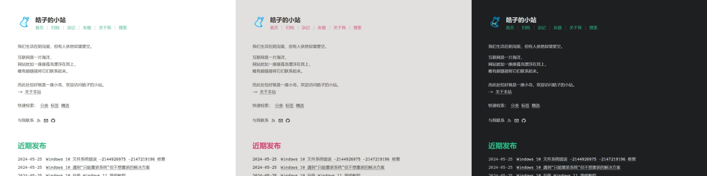
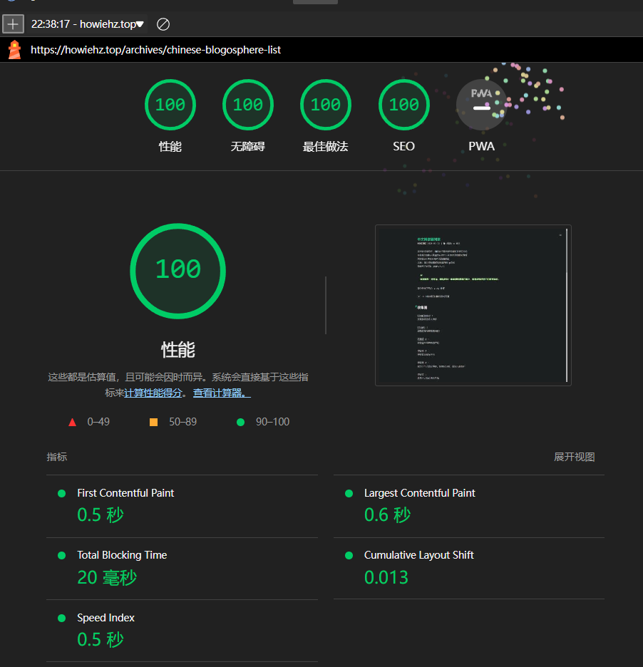

# halo-theme-higan-hz


## 说明

该主题是 guqing 的 [halo-theme-higan](https://github.com/guqing/halo-theme-higan) 进行了定制化修改后的主题

> 更激进的修改，更高的配置自由度！

### 修改内容概要

1. 可自定义更多内容
   - 页面样式
   - 固定文字
2. 修复错误
3. 支持更多特色功能
   - 防止站点被恶意镜像
   - CSP: upgrade-insecure-requests
   - 文章页标题自定义
4. 更多功能等您来探索...



文档版本: `1.9.0`  
（如此处文档版本小于您正在使用的主题版本，说明您正在阅读一份过时的文档，请到[项目原地址](https://github.com/HowieHz/halo-theme-higan-hz/blob/main/README.md)阅读最新版本。）

### 目录

- [halo-theme-higan-hz](#halo-theme-higan-hz)
  - [说明](#说明)
    - [修改内容概要](#修改内容概要)
    - [目录](#目录)
  - [相较于原始主题 最新开发版 的修改](#相较于原始主题-最新开发版-的修改)
    - [样式修复](#样式修复)
    - [不可配置的样式修改](#不可配置的样式修改)
    - [配置项修改](#配置项修改)
      - [增加于“全局”](#增加于全局)
      - [增加于“总体样式”](#增加于总体样式)
      - [增加于“首页样式”](#增加于首页样式)
      - [增加于“文章页样式”](#增加于文章页样式)
      - [添加于“分类集合页样式”](#添加于分类集合页样式)
      - [增加于“自定义页面样式”](#增加于自定义页面样式)
      - [增加于“瞬间页样式”](#增加于瞬间页样式)
      - [增加于 “RSS”](#增加于-rss)
      - [增加于“社交资料”](#增加于社交资料)
      - [增加于文章元数据](#增加于文章元数据)
      - [调整于“总体样式”](#调整于总体样式)
      - [调整于“首页样式”](#调整于首页样式)
    - [杂项（对主题使用者大概无感的修改）](#杂项对主题使用者大概无感的修改)
      - [杂项于“总体样式”](#杂项于总体样式)
  - [已合并至上游的内容/上游也已修复的内容](#已合并至上游的内容上游也已修复的内容)
  - [原项目说明](#原项目说明)
  - [主题应用实例](#主题应用实例)
  - [如何获取主题包](#如何获取主题包)
    - [稳定版获取方法](#稳定版获取方法)
    - [最新开发版获取方法](#最新开发版获取方法)
  - [可选插件（主题使用者必看章节！）](#可选插件主题使用者必看章节)
  - [进行此项目的开发](#进行此项目的开发)
    - [开发前准备](#开发前准备)
      - [安装 pnpm](#安装-pnpm)
      - [安装项目依赖](#安装项目依赖)
    - [开发主题](#开发主题)
    - [开发之后](#开发之后)
      - [求疵](#求疵)
      - [格式化代码](#格式化代码)
      - [构建主题](#构建主题)
      - [其他 NPM 脚本的作用](#其他-npm-脚本的作用)
  - [版本适用说明](#版本适用说明)
  - [TODO](#todo)
  - [Lighthouse](#lighthouse)
  - [项目状态](#项目状态)
  - [Star History](#star-history)

## 相较于原始主题 最新开发版 的修改

原主题最新版本为：[v2.9.0](https://github.com/guqing/halo-theme-higan/releases/tag/v2.9.0)  
而本主题修改基于最新开发版：[上游提交日志](https://github.com/guqing/halo-theme-higan/commits/main/)

### 样式修复

1. 移除导航栏文字前出现的空白 _[guqing/halo-theme-higan#113](https://github.com/guqing/halo-theme-higan/issues/113)_
2. 使用 PostCSS + Tailwind CSS + daisyUI 重构，修复上游标注在标签的 class 内但没有正常引入的样式，以及没有正常工作的样式。

### 不可配置的样式修改

> 如果添加的样式修改是可被配置的（如可修改，可关闭），则不会被列举在此处

1. 新增文章顶部分享栏分享方式: QQ 空间
2. 修改文章顶部分享栏 Twitter 的链接为 X
3. 友链页面允许用户在链接描述使用 HTML 代码块

### 配置项修改

为方便查找，本主题将选项分类到多栏目下，而不是像原主题集中在一个“样式”栏下。  
现分类为“全局”，“总体样式”，“首页样式”，“文章页样式”，“分类集合页样式”，“自定义页面样式”，“瞬间页样式”，“RSS”，“社交资料”。

解释：“现主题设置项位置”（原主题设置项位置）-> 小括号内的为“现主题设置项位置”对应的“原主题设置项位置“。

例：在[增加于“总体样式”](#增加于总体样式)这一章节中有如下文字：

- “配色方案”（样式-配色方案）

其含义为“总体样式-配色方案”对应原主题“样式-配色方案”选项。

#### 增加于“全局”

1. 添加“CSP:upgrade-insecure-requests”选项，避免 HTTPS 协议网页引用 HTTP 资源时报错。相关文档：[CSP: upgrade-insecure-requests - HTTP | MDN](https://developer.mozilla.org/zh-CN/docs/Web/HTTP/Headers/Content-Security-Policy/upgrade-insecure-requests)
2. 增加“仅允许使用指定域名访问”。使用场景：防止站点被恶意镜像后的流量流失

#### 增加于“总体样式”

1. “配色方案”（样式-配色方案）添加“跟随系统”选项
2. 对于内容区域宽度给予更大的配置自由度
   （说明：原主题在之后的更新里更新了自适应最大宽度设置，内容区域最大宽度将随着屏幕宽度的变化而变化。但是在文字内容较少时（如主页），会显得内容显示位置偏左，因此“可自定义内容区域最大宽度”默认开启。
   如果你想使用上游的最大宽度设置模式，请关闭“总体样式-自定义内容区域最大宽度”这一项设置，并且推荐同时开启“内容区域最小宽度”，“自定义内容区域宽度属性”并保持默认值，可有效解决文字较少时内容显示偏左的问题）
   1. 可自定义内容区域最大宽度
      （默认值为 48rem。允许全部 CSS 长度单位, 如: 48rem, 780px, 70vw, 70%。宽度最大值设置较大时可能会出现内容整体偏左的现象。为解决这个问题，可同时开启“内容区域最小宽度”，“自定义内容区域宽度属性”并保持默认值。）
   2. 可自定义内容区域最小宽度
      （默认值为 48rem。允许全部 CSS 长度单位, 如: 48rem, 780px, 70vw, 70%。当此设置宽度小于窗口宽度时，主题会使用窗口宽度。以避免出现横向滚动条。）
      - 允许强制应用内容区域最小宽度
        （强制使内容显示区域不小于设定的最小宽度，即使出现横向滚动条。）
   3. 可自定义内容区域宽度属性
      （默认值为 fit-content。默认值效果为：使内容区域宽度=最宽的内容的宽度。（此项实际是在设置内容区域的 width 属性对应的样式值））
3. 允许关闭页面底部主题信息
4. 允许关闭页面底部版权信息
5. 允许关闭页面底部菜单
6. 允许添加内容到页脚最底部

#### 增加于“首页样式”

1. 允许设定主页 HTML 标题，而不是取值于“Halo 设置-基本设置-站点标题”
2. 允许同时开启一言和个人简介
3. 允许用户修改主页上的固定文本 _[guqing/halo-theme-higan#86](https://github.com/guqing/halo-theme-higan/issues/86)_
   - 默认值相较于原主题的变化
     - Writing -> 近期发布
     - Read article -> 阅读全文
     - Find me on -> 与我联系
4. 允许自由选择是否开关文章列表置顶图标，以及选择图标位置

#### 增加于“文章页样式”

1. 将“文章标题大写”（样式-文章标题大写）配置项移动到这一栏下
2. 允许选择是否启用文章与评论区间的分隔线
3. 允许选择是否启用文章评论区

#### 添加于“分类集合页样式”

1. 允许选择是否显示每个分类下的文章数量
2. 允许设置在“文章数量”左侧的字符
3. 允许设置在“文章数量”右侧的字符
4. 允许选择是否显示多层分类

#### 增加于“自定义页面样式”

1. 允许选择是否启用正文内容与评论区间的分隔线
2. 允许选择是否启用评论区

#### 增加于“瞬间页样式”

1. 允许选择是否启用点赞按钮
2. 允许选择是否启用评论区

#### 增加于 “RSS”

1. 将“首页 RSS 展示”（社交资料-RSS）配置项移动到这一栏下
2. 允许自定义 RSS 地址

#### 增加于“社交资料”

1. 允许设置多个重复的社交平台
2. 允许设置社交平台的排列顺序
3. 在原支持 Dribbble, Email, Facebook, Github, Instagram, QQ, Telegram, X, 微博的基础上  
   额外增加对 BiliBili, Reddit, Stack Overflow, YouTube, 豆瓣, 网易云音乐, 知乎的支持  
   注：没有简书和 CSDN(Copy, Steal and pay-Download Net) 的原因是平台过于小众，甚至 iconify 找不到它们的图标

#### 增加于文章元数据

如何找到一篇文章元数据设置位置：

- 方法一：进入后台管理页面 -> 找到文章管理页 -> 点击一篇文章右边的三个点 -> 弹出的上下文菜单中选择“设置” -> 拉到底部即可见元数据设置位
- 方法二：进入后台管理页面 -> 找到文章管理页 -> 进入一篇文章的编辑页 -> 点击右上角“发布”按钮左侧的“设置”按钮 -> 拉到底部即可见元数据设置位

1. 增加“页面标题”配置项，可设定此文章的在浏览页的 HTML 标题（如配置值为空，则 HTML 标题取此文章的标题）

#### 调整于“总体样式”

1. 配色方案（样式-配色方案）对应的配置名修改:
   - 暗黑 -> 暗色
   - 白色 -> 亮色
   - 亮色 -> 灰粉

#### 调整于“首页样式”

1. 个人简介（样式-个人简介）输入框高度修改: 100px -> 150px

### 杂项（对主题使用者大概无感的修改）

1. 修改 html 标签 lang 属性值，从 en 修改为 zh。
2. 重构样式切换方式 (原来是 body 标签的 class 决定样式，现在是 body 标签的 theme 属性的值决定样式)
3. 修改项目内各种链接指向分叉后的项目链接，并修改元数据避免与原主题冲突
4. 清除无用样式，减小最终文件体积

#### 杂项于“总体样式”

1. 配色方案（样式-配色方案）对应的内部配置值修改，修改值详情请看 [v1.0.1](https://github.com/HowieHz/halo-theme-higan-hz/releases/tag/v1.0.1)

## 已合并至上游的内容/上游也已修复的内容

<details><summary>点我展开详情</summary>

1. 关闭未关闭的 `label`，使得 `prettier` 能正常格式化文件 _[guqing/halo-theme-higan#92](https://github.com/guqing/halo-theme-higan/pull/92)_
2. 修复原项目不可用的格式化脚本 (`package.json` 内的 `npm` 脚本) _[guqing/halo-theme-higan#91](https://github.com/guqing/halo-theme-higan/pull/91)_
3. 页面底部的版权信息进行了分行避免在小屏上排版错乱 _[guqing/halo-theme-higan#87](https://github.com/guqing/halo-theme-higan/issues/87)[#108](https://github.com/guqing/halo-theme-higan/pull/108)_
4. 补充了部分缺失的 `aria-label` 属性 _[guqing/halo-theme-higan#83](https://github.com/guqing/halo-theme-higan/issues/83)[#110](https://github.com/guqing/halo-theme-higan/pull/110)_
5. 修复行内代码渲染问题 _[guqing/halo-theme-higan#85](https://github.com/guqing/halo-theme-higan/issues/85)[#109](https://github.com/guqing/halo-theme-higan/pull/109)_
6. 修复错误的大纲定位样式 _[guqing/halo-theme-higan#69](https://github.com/guqing/halo-theme-higan/issues/69)[#112](https://github.com/guqing/halo-theme-higan/pull/112)_

</details>

## 原项目说明

该主题的原作者为 Pieter Robberechts，非常感谢做出这么优秀的主题。

原主题地址：[hexo-theme-cactus](https://github.com/probberechts/hexo-theme-cactus.git)

## 主题应用实例

[howiehz.top](https://howiehz.top)

## 如何获取主题包

### 稳定版获取方法

1. 到 [Release](https://github.com/HowieHz/halo-theme-higan-hz/releases) 下载最新版的 “Source code (zip)”
2. 在 Console 端的主题菜单直接上传安装即可使用

Release v1.2.1 包括之后的版本已上架 halo 应用市场，直接到商店页面下载即可

- 市场链接：[应用：彼岸-皓改](https://www.halo.run/store/apps/app-homxf?tab=releases)

### 最新开发版获取方法

1. 点击项目主页 [HowieHz/halo-theme-higan-hz](https://github.com/HowieHz/halo-theme-higan-hz/tree/main) 绿色的 “<> Code” 按钮
2. 选择 “Download ZIP” 下载最新代码
3. 在 Console 端的主题菜单直接上传安装即可使用

## 可选插件（主题使用者必看章节！）

- 友链页面（/links），需插件 [plugin-links](https://github.com/halo-sigs/plugin-links)
- 图库页面（/photos），需插件 [plugin-photos](https://github.com/halo-sigs/plugin-photos)
- 瞬间页面（/moments），需插件 [plugin-moments](https://github.com/halo-sigs/plugin-moments)
  - 瞬间页面可用于展示 github 活动，此用法请看 [howiehz/ghu-events-moments](https://github.com/howiehz/ghu-events-moments) 或 [guqing/ghu-events-moments](https://github.com/guqing/ghu-events-moments)（兼容原主题数据类型）
- 评论功能，需插件 [plugin-comment-widget](https://github.com/halo-sigs/plugin-comment-widget/releases)
- 搜索功能，需插件 [plugin-search-widget](https://github.com/halo-sigs/plugin-search-widget/releases)
- 代码渲染，需插件: [plugin-highlightjs](https://github.com/halo-sigs/plugin-highlightjs)
- - 暗黑模式下，代码块高亮主题推荐选择 “an-old-hope.min.css”
- 图片灯箱，需插件: [plugin-lightgallery](https://github.com/halo-sigs/plugin-lightgallery)

- - 页面匹配规则 推荐设置为

| 路径匹配       | 匹配区域                   |
| -------------- | -------------------------- |
| `/archives/**` | `article .content`         |
| `/moments`     | `article .content .medium` |
| `/moments/**`  | `article .content .medium` |

## 进行此项目的开发

首先请确保你的编辑器支持 EditorConfig，这保证了项目代码格式的统一。

### 开发前准备

#### 安装 pnpm

需要提前安装 Node.js，然后运行以下指令安装 pnpm

```bash
npm install -g pnpm
```

#### 安装项目依赖

之后在项目根目录运行以下指令完成依赖的安装

```bash
pnpm install
```

### 开发主题

开发时在项目根目录运行运行以下指令可实时渲染修改

```bash
pnpm dev
```

### 开发之后

#### 求疵

开发完成后请运行以下的指令进行检查（请确保无 error）

```bash
pnpm lint
```

#### 格式化代码

提交前请运行以下的指令的指令格式化代码

```bash
pnpm format
```

#### 构建主题

最后在提交前请不要忘记运行以下的指令构建主题

```bash
pnpm build
```

#### 其他 NPM 脚本的作用

在 .\tmp\ 目录输出未压缩的样式文件，便于追踪问题

```bash
pnpm dev-build
```

<!-- #### 打包主题

```bash
pnpm release
``` -->

## 版本适用说明

当前 main 分支适用于 Halo 2.0 版本

适用于 Halo 1.x 版本的主题位于分支 [halo-theme-higan 1.x](https://github.com/HowieHz/halo-theme-higan-hz/tree/1.x)

## TODO

见 [项目 Issue 页面](https://github.com/HowieHz/halo-theme-higan-hz/issues)  
注：社区意愿较大的 Issue 会列为优先项。如果你对某功能有需求，请一定要在对应 Issue 下回复，或进入我的博客通过其他联系方式联系我，谢谢！

## Lighthouse



## 项目状态


## Star History

[](https://star-history.com/#HowieHz/halo-theme-higan-hz&Date)
