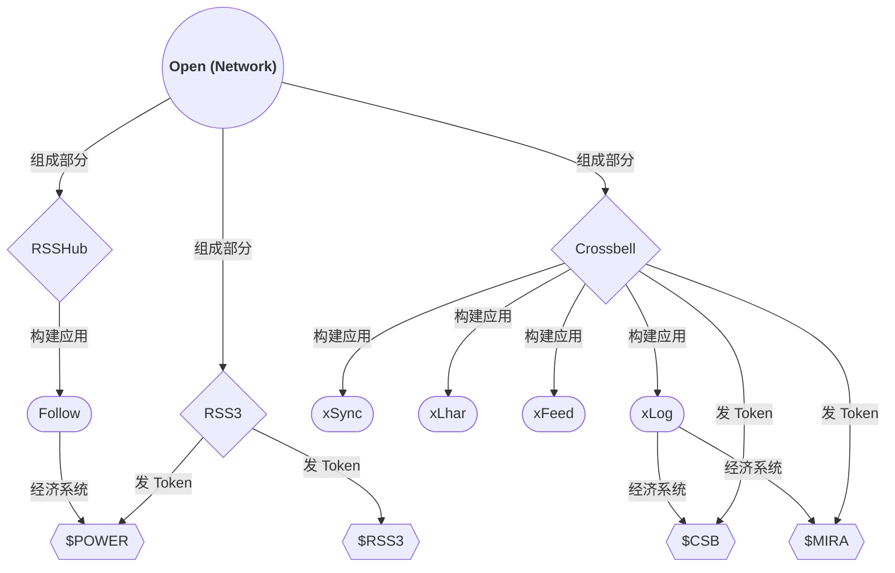
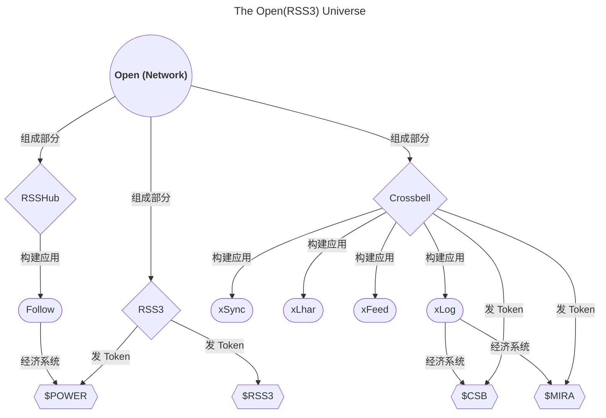
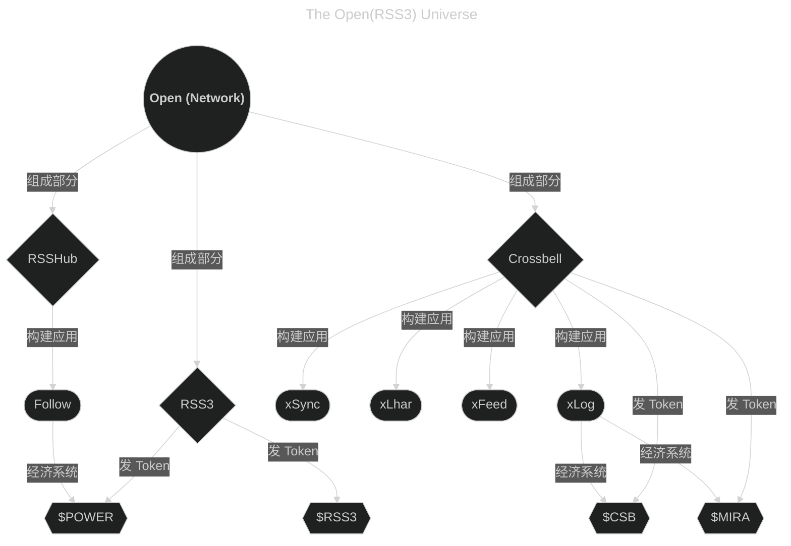

# halo-theme-higan-hz


## 说明

该主题是 guqing 的 [halo-theme-higan](https://github.com/guqing/halo-theme-higan) 进行了定制化修改后的主题

> 更激进的修改，更高的配置自由度！

### 特色功能概要

1. 可自定义更多内容
   - 页面样式
   - 固定文字
   - 关闭一切你想关闭的部分！
2. 修复错误
3. 添加轻量的过渡动画
4. [预设更多配色方案/支持自定义配色方案](#more-color-scheme)
5. 支持更多特色功能
   - [浅色/深色模式切换按钮](#theme-switch-button-anchor)
   - 防止站点被恶意镜像
   - CSP: upgrade-insecure-requests
   - 文章页标题自定义
   - 完善的多语言支持（多语言文字支持，多语言菜单支持，详情请见文档[i18n 支持指南](#i18n-支持指南)）
   - [Mermaid 明暗切换支持](#mermaid-明暗切换支持)
   - [设置内容仅在浅色/深色模式下显示](#设置内容仅在浅色深色模式下显示)
   - [适配相册插件](#增加于相册页样式)，支持瀑布流布局
6. 更多功能等您来探索...

### 作者的碎碎语

主题使用前必看章节：[可选插件](#可选插件)

如果你喜欢这个主题，请给项目点个 Star 吧！  
你的 Star 和支持将成为我持续更新的动力！

欢迎大家加入主题交流群（QQ）：[点击链接加入群聊 群号 694413711](http://qm.qq.com/cgi-bin/qm/qr?_wv=1027&k=QCcmLkzDHUT22qP_-MVYSYDwlL_Jf55Y&authKey=KWfge330T3nQAJy96gacr8eyp8u0egY3tNGBFAnNjqdBdMJKQLp9I9efUU9aMiGM&noverify=0&group_code=694413711)  
如果你愿意支持我，也可以加入群聊，与我交流，让我知道除了我自己，还有其他人在使用这个主题 :)

欢迎基于此项目进行 Fork，如果你能提个 Issue 那就更好了。无论需求多么奇特，我都会尽力添加 \^\_\^

最初，这个项目只是为了满足自己的一些独特需求而创建。然而，如今已有许多小伙伴在使用这个主题，并通过各种渠道反馈意见，帮助我不断优化和改进。由衷感谢大家的支持与鼓励！  
此外，我没想到还有小伙伴通过打赏支持这个项目，特此列出名单表示感谢！[赞助名单](#感谢赞助)


文档版本：`1.32.0`  
（如此处文档版本小于您正在使用的主题版本，说明您正在阅读一份过时的文档，请到[项目原地址](https://github.com/HowieHz/halo-theme-higan-hz/blob/main/README.md)阅读最新版本。）

### 目录

- [halo-theme-higan-hz](#halo-theme-higan-hz)
  - [说明](#说明)
    - [特色功能概要](#特色功能概要)
    - [作者的碎碎语](#作者的碎碎语)
    - [目录](#目录)
  - [i18n 支持指南](#i18n-支持指南)
    - [站点默认语言标识](#站点默认语言标识)
    - [修改文章页面语言标识](#修改文章页面语言标识)
    - [修改分类页面语言标识](#修改分类页面语言标识)
    - [修改标签页面语言标识](#修改标签页面语言标识)
    - [修改独立页面语言标识](#修改独立页面语言标识)
    - [修改页面固定文字（修改语言文件）](#修改页面固定文字修改语言文件)
    - [多语言菜单使用指南](#多语言菜单使用指南)
    - [多语言个人简介/公告栏使用指南](#多语言个人简介公告栏使用指南)
    - [多语言页面最底部内容使用指南](#多语言页面最底部内容使用指南)
  - [相较于原始主题 最新开发版 的修改](#相较于原始主题-最新开发版-的修改)
    - [样式修复](#样式修复)
    - [不可配置的样式修改](#不可配置的样式修改)
    - [配置项修改](#配置项修改)
      - [增加于“全局”](#增加于全局)
      - [增加于“总体样式”](#增加于总体样式)
      - [增加于“首页样式”](#增加于首页样式)
      - [增加于“文章页样式”](#增加于文章页样式)
      - [添加于“分类集合页样式”](#添加于分类集合页样式)
      - [添加于“分类详情页样式”](#添加于分类详情页样式)
      - [添加于“标签详情页样式”](#添加于标签详情页样式)
      - [添加于"归档页样式"](#添加于归档页样式)
      - [增加于“自定义页面样式”](#增加于自定义页面样式)
      - [增加于“相册页样式”](#增加于相册页样式)
      - [增加于“瞬间页样式”](#增加于瞬间页样式)
      - [增加于“社交资料/RSS”](#增加于社交资料rss)
      - [添加于“页面分享按钮设置”](#添加于页面分享按钮设置)
      - [添加于“错误页样式”](#添加于错误页样式)
      - [增加于文章元数据](#增加于文章元数据)
      - [增加于分类元数据](#增加于分类元数据)
      - [增加于标签元数据](#增加于标签元数据)
      - [增加于页面元数据](#增加于页面元数据)
      - [调整于“总体样式”](#调整于总体样式)
      - [调整于“首页样式”](#调整于首页样式)
    - [杂项（对主题使用者大概无感的修改）](#杂项对主题使用者大概无感的修改)
  - [原项目说明](#原项目说明)
  - [主题应用实例](#主题应用实例)
  - [如何获取主题包](#如何获取主题包)
    - [稳定版获取方法](#稳定版获取方法)
    - [最新开发版获取方法](#最新开发版获取方法)
  - [可选插件](#可选插件)
    - [Mermaid 明暗切换支持](#mermaid-明暗切换支持)
      - [使用默认编辑器](#使用默认编辑器)
        - [示例](#示例)
        - [使用说明](#使用说明)
      - [使用 Vditor 编辑器](#使用-vditor-编辑器)
        - [示例](#示例-1)
        - [使用说明](#使用说明-1)
  - [设置内容仅在浅色/深色模式下显示](#设置内容仅在浅色深色模式下显示)
    - [使用默认编辑器](#使用默认编辑器-1)
    - [使用 Vditor 编辑器](#使用-vditor-编辑器-1)
  - [开发指南/贡献指南](#开发指南贡献指南)
  - [Lighthouse](#lighthouse)
  - [TODO](#todo)
  - [感谢赞助](#感谢赞助)
  - [项目状态](#项目状态)
    - [Repobeats analytics](#repobeats-analytics)
    - [Star History](#star-history)

## i18n 支持指南

### 站点默认语言标识

修改“全局 - 默认页面语言”，详情请见[增加于“全局”](#增加于全局)

### 修改文章页面语言标识

详情请见 [增加于文章元数据](#增加于文章元数据)

### 修改分类页面语言标识

详情请见 [增加于分类元数据](#增加于分类元数据)

### 修改标签页面语言标识

详情请见 [增加于标签元数据](#增加于标签元数据)

### 修改独立页面语言标识

详情请见 [增加于页面元数据](#增加于页面元数据)

### 修改页面固定文字（修改语言文件）

请到 halo 主题目录（themes），找到 howiehz-higan 文件夹里的 i18n 文件夹，找到对应语言的 properties 文件，修改保存即可（如中文是 zh.properties）

### 多语言菜单使用指南

（注：按 f12 打开开发者控制台，上面选择控制台，输入 navigator.language 后回车即可查看你浏览器的 navigator.language 值）

启用“全局 - 多语言菜单支持”选项后，主菜单应设置形如以下形式（注：“zh_CN”项可选择自定义链接，链接为 /，名称为 zh_CN。其中名称为关键设置，其他不影响）

- zh_CN
  - 首页
  - 关于
- en_US
  - Home
  - About
- default
  - Home
  - About

启用“全局 - 多语言菜单前缀匹配模式”，启用此项将允许菜单名符合 navigator.language 值前缀即显示，而无需完全匹配。（注：开启了这项之后，下面的“zh”可匹配 zh_CN，zh_TW 等 navigator.language 值。）
以上菜单可改为：

- zh
  - 首页
  - 关于
- en
  - Home
  - About
- default
  - Home
  - About

“默认多语言菜单名称”默认值为 default，你也可以设定为如 zh_CN，但是要注意这里是**完全匹配菜单名**，即使开启了“多语言菜单前缀匹配模式”。
默认菜单将在没有菜单成功匹配的时候显示。

### 多语言个人简介/公告栏使用指南

（注：按 f12 打开开发者控制台，上面选择控制台，输入 navigator.language 后回车即可查看你浏览器的 navigator.language 值）

启用“首页样式 - 多语言个人简介/公告栏支持”选项后，“首页样式 - 自定义多语言公告栏内容”应设置形如以下形式（注：“zh_CN”项可选择自定义链接，链接为 /，名称为 zh_CN。其中名称为关键设置，其他不影响）

- - “语言代码”设置值：zh_CN
  - “个人简介/公告栏内容（支持 html 代码块）”设置值：你好！
- - “语言代码”设置值：en_US
  - “个人简介/公告栏内容（支持 html 代码块）”设置值：Hello!
- - “语言代码”设置值：default
  - “个人简介/公告栏内容（支持 html 代码块）”设置值：Hello!

启用“首页样式 - 多语言公告栏前缀匹配模式”，启用此项将允许“语言代码”设置值符合 navigator.language 值前缀即显示，而无需完全匹配。（注：开启了这项之后，下面的“zh”可匹配 zh_CN，zh_TW 等 navigator.language 值。）
以上菜单可改为：

- - “语言代码”设置值：zh
  - “个人简介/公告栏内容（支持 html 代码块）”设置值：你好！
- - “语言代码”设置值：en
  - “个人简介/公告栏内容（支持 html 代码块）”设置值：Hello!
- - “语言代码”设置值：default
  - “个人简介/公告栏内容（支持 html 代码块）”设置值：Hello!

“默认多语言公告栏语言代码”默认值为 default，你也可以设定为如 zh_CN，但是要注意这里是**完全匹配“语言代码”设置值**，即使开启了“多语言菜单前缀匹配模式”。
默认多语言公告栏将在没有公告栏成功匹配的时候显示。

### 多语言页面最底部内容使用指南

（注：按 f12 打开开发者控制台，上面选择控制台，输入 navigator.language 后回车即可查看你浏览器的 navigator.language 值）

启用“总体样式 - 多语言页面最底部内容支持”选项后，“总体样式 - 自定义多语言页面最底部内容”应设置形如以下形式（注：“zh_CN”项可选择自定义链接，链接为 /，名称为 zh_CN。其中名称为关键设置，其他不影响）

- - “语言代码”设置值：zh_CN
  - “页面最底部内容（支持 html 代码块）”设置值：你好！
- - “语言代码”设置值：en_US
  - “页面最底部内容（支持 html 代码块）”设置值：Hello!
- - “语言代码”设置值：default
  - “页面最底部内容（支持 html 代码块）”设置值：Hello!

启用“总体样式 - 多语言页面最底部内容前缀匹配模式”，启用此项将允许“语言代码”设置值符合 navigator.language 值前缀即显示，而无需完全匹配。（注：开启了这项之后，下面的“zh”可匹配 zh_CN，zh_TW 等 navigator.language 值。）
以上菜单可改为：

- - “语言代码”设置值：zh
  - “页面最底部内容（支持 html 代码块）”设置值：你好！
- - “语言代码”设置值：en
  - “页面最底部内容（支持 html 代码块）”设置值：Hello!
- - “语言代码”设置值：default
  - “页面最底部内容（支持 html 代码块）”设置值：Hello!

“默认多语言页面最底部内容的语言代码”默认值为 default，你也可以设定为如 zh_CN，但是要注意这里是**完全匹配“语言代码”设置值**，即使开启了“多语言菜单前缀匹配模式”。
默认多语言页面最底部内容将在没有页面最底部内容成功匹配的时候显示。

## 相较于原始主题 最新开发版 的修改

原主题最新版本为：[v2.9.1](https://github.com/guqing/halo-theme-higan/releases/tag/v2.9.1)  
而本主题修改基于最新开发版：[上游提交日志](https://github.com/guqing/halo-theme-higan/commits/main/)

### 样式修复

1. 移除导航栏文字前出现的空白 _[guqing/halo-theme-higan#113](https://github.com/guqing/halo-theme-higan/issues/113)_
2. 使用 PostCSS + Tailwind CSS + daisyUI 重构，修复上游标注在标签的 class 内但没有正常引入的样式，以及没有正常工作的样式。
3. 修复在文章页平板端模式下，回到顶部按钮未正常显示的问题
4. 修复在文章页平板端模式下，菜单不能随菜单按钮一起隐藏的问题
5. 修复在文章页桌面端模式下，隐藏的顶部导航栏依然会遮挡页面按钮的问题 _[#89](https://github.com/HowieHz/halo-theme-higan-hz/issues/89)_
6. 修复分享按钮无法获取准确链接的问题

### 不可配置的样式修改

> 如果添加的样式修改是可被配置的（如可修改，可关闭），则不会被列举在此处

1. 新增文章顶部分享栏分享方式：QQ 空间
2. 修改文章顶部分享栏 Twitter 的链接为 X
3. 友链页面允许用户在链接描述使用 HTML 代码块
4. 为非文章页移动端模式下，顶部导航栏的出现和消失添加了动画
5. 为文章页移动端模式下，底部导航栏（包括子菜单，其中的回到顶部按钮）的出现和消失添加了动画
6. 为文章页桌面端模式下，顶部导航栏（包括子菜单）的出现和消失添加了动画
7. 为文章页平板端模式下，顶部导航栏（包括子菜单）和右下角的回到顶部按钮出现和消失添加了动画

### 配置项修改

为方便查找，本主题将选项分类到多栏目下，而不是像原主题集中在一个“样式”栏下。  
现分类为“全局”，“总体样式”，“首页样式”，“文章页样式”，“分类集合页样式”，“自定义页面样式”，“瞬间页样式”，“RSS”，“社交资料”。

解释：“现主题设置项位置”（原主题设置项位置）-> 小括号内的为“现主题设置项位置”对应的“原主题设置项位置“。

例：在[增加于“总体样式”](#增加于总体样式)这一章节中有如下文字：

- “配色方案”（样式 - 配色方案）

其含义为“总体样式 - 配色方案”对应原主题“样式 - 配色方案”选项。

#### 增加于“全局”

1. 添加“默认页面语言”，允许指定站点默认的页面语言（HTML lang 属性）（如配置值为空，则设置为 "zh"）
2. 添加“多语言菜单支持”，允许用户定义多套菜单适用于不同语言。
   - 添加“多语言菜单前缀匹配模式”，启用此项将允许菜单名符合 navigator.language 值前缀即显示，而无需完全匹配。
   - 添加“默认多语言菜单名称”，可设定默认菜单。默认菜单将在没有菜单成功匹配的时候显示。
   - 此项使用教程请看 [多语言菜单使用指南](#多语言菜单使用指南)
3. 添加“CSP:upgrade-insecure-requests”选项，避免 HTTPS 协议网页引用 HTTP 资源时报错。相关文档：[CSP: upgrade-insecure-requests - HTTP | MDN](https://developer.mozilla.org/zh-CN/docs/Web/HTTP/Headers/Content-Security-Policy/upgrade-insecure-requests)
4. 增加“仅允许使用指定域名访问”。使用场景：防止站点被恶意镜像后的流量流失。
5. 增加“自定义资源位置地址”，允许指定资源位置地址（如主要 CSS 资源，主要 JavaScript 资源）。
6. 增加“instant.page 支持”，自动加载 instant.page 脚本，以提升页面加载速度。

#### 增加于“总体样式”

1. <a id="more-color-scheme"></a>“配色方案”（样式 - 配色方案）
   - 添加“跟随系统”配色方案
   - 添加蓝色系列配色方案
2. 支持自定义配色方案
   - 使用步骤
     1. 在此处创建自定义配色方案，填写好对应信息，记住"自定义配色方案识别码"
     2. “配色方案”、”自动模式配色方案“（需启用“浅色/深色模式切换按钮”）、“浅色模式配色方案”（需启用“浅色/深色模式切换按钮”），“深色模式配色方案”（需启用“浅色/深色模式切换按钮”），中选择“自定义配色选项”。
     3. 在选项下方新出现的输入框中填写你的"自定义配色方案识别码"
     4. 即可使用你自定义的配色方案

<details><summary>点我展开自定义配色示例</summary>

深色模式示例（启用 CSS 原始输出模式）  
实际使用时请将填写的”识别码“替换 {id}

```css
html[theme="theme-{id}"] {
  --color-accent-1: #2bbc8a;
  --color-accent-2: #eee;
  --color-accent-3: #ccc;
  --color-avatar-border: #212326;
  --color-background: #1d1f21;
  --color-background-code: #d5d7d8;
  --color-border: #908d8d;
  --color-card-hover: #212326;
  --color-divide: #616161;
  --color-footer-mobile-1: #a4a3a3;
  --color-footer-mobile-2: #27292b;
  --color-footer-mobile-3: #1f2325;
  --color-highlight-background: #212326;
  --color-link: #d480aa;
  --color-meta: #908d8d;
  --color-meta-code: #908d8d;
  --color-quote: #ccffb6;
  --color-scrollbar: #999;
  --color-text: #d5d7d8;
  --color-time: #adaeaf;
  --toc-level-2: #e3e3e3;
  --toc-level-3: #b0b0b0;
  --toc-level-4: #636363;
}
html[theme="theme-{id}"] comment-widget {
  --halo-comment-widget-component-form-input-bg-color: #1d1f21 !important;
  --halo-comment-widget-component-form-input-border-color: #636363 !important;
}
```

浅色模式示例（启用 CSS 原始输出模式）  
实际使用时请将填写的”识别码“替换 {id}

```css
html[theme="theme-{id}"] {
  --color-accent-1: #2bbc8a;
  --color-accent-2: #383838;
  --color-accent-3: #676767;
  --color-avatar-border: #fafafa;
  --color-background: #fff;
  --color-background-code: #fafafa;
  --color-border: #666;
  --color-card-hover: #fafafa;
  --color-divide: #e5e7eb;
  --color-footer-mobile-1: #666;
  --color-footer-mobile-2: #e6e6e6;
  --color-footer-mobile-3: #fafafa;
  --color-highlight-background: #212326;
  --color-link: #d480aa;
  --color-meta: #666;
  --color-meta-code: #808080;
  --color-quote: #2bbc8a;
  --color-scrollbar: #aaa;
  --color-text: #333;
  --color-time: #595858;
  --toc-level-2: #383838;
  --toc-level-3: #666;
  --toc-level-4: #888;
}
html[theme="theme-{id}"] comment-widget {
  --halo-comment-widget-component-form-input-bg-color: #fff !important;
}
```

自动模式示例（启用 CSS 原始输出模式）  
实际使用时请将填写的”识别码“替换 {id}

```css
@media (prefers-color-scheme: no-preference) {
  html[theme="theme-{id}"] {
    --color-accent-1: #2bbc8a;
    --color-accent-2: #383838;
    --color-accent-3: #676767;
    --color-avatar-border: #fafafa;
    --color-background: #fff;
    --color-background-code: #fafafa;
    --color-border: #666;
    --color-card-hover: #fafafa;
    --color-divide: #e5e7eb;
    --color-footer-mobile-1: #666;
    --color-footer-mobile-2: #e6e6e6;
    --color-footer-mobile-3: #fafafa;
    --color-highlight-background: #212326;
    --color-link: #d480aa;
    --color-meta: #666;
    --color-meta-code: #808080;
    --color-quote: #2bbc8a;
    --color-scrollbar: #aaa;
    --color-text: #333;
    --color-time: #595858;
    --toc-level-2: #383838;
    --toc-level-3: #666;
    --toc-level-4: #888;
  }
  html[theme="theme-{id}"] comment-widget {
    --halo-comment-widget-component-form-input-bg-color: #fff !important;
  }
}
@media (prefers-color-scheme: light) {
  html[theme="theme-{id}"] {
    --color-accent-1: #2bbc8a;
    --color-accent-2: #383838;
    --color-accent-3: #676767;
    --color-avatar-border: #fafafa;
    --color-background: #fff;
    --color-background-code: #fafafa;
    --color-border: #666;
    --color-card-hover: #fafafa;
    --color-divide: #e5e7eb;
    --color-footer-mobile-1: #666;
    --color-footer-mobile-2: #e6e6e6;
    --color-footer-mobile-3: #fafafa;
    --color-highlight-background: #212326;
    --color-link: #d480aa;
    --color-meta: #666;
    --color-meta-code: #808080;
    --color-quote: #2bbc8a;
    --color-scrollbar: #aaa;
    --color-text: #333;
    --color-time: #595858;
    --toc-level-2: #383838;
    --toc-level-3: #666;
    --toc-level-4: #888;
  }
  html[theme="theme-{id}"] comment-widget {
    --halo-comment-widget-component-form-input-bg-color: #fff !important;
  }
}
@media (prefers-color-scheme: dark) {
  html[theme="theme-{id}"] {
    --color-accent-1: #2bbc8a;
    --color-accent-2: #eee;
    --color-accent-3: #ccc;
    --color-avatar-border: #212326;
    --color-background: #1d1f21;
    --color-background-code: #d5d7d8;
    --color-border: #908d8d;
    --color-card-hover: #212326;
    --color-divide: #616161;
    --color-footer-mobile-1: #a4a3a3;
    --color-footer-mobile-2: #27292b;
    --color-footer-mobile-3: #1f2325;
    --color-highlight-background: #212326;
    --color-link: #d480aa;
    --color-meta: #908d8d;
    --color-meta-code: #908d8d;
    --color-quote: #ccffb6;
    --color-scrollbar: #999;
    --color-text: #d5d7d8;
    --color-time: #adaeaf;
    --toc-level-2: #e3e3e3;
    --toc-level-3: #b0b0b0;
    --toc-level-4: #636363;
  }
  html[theme="theme-{id}"] comment-widget {
    --halo-comment-widget-component-form-input-bg-color: #1d1f21 !important;
    --halo-comment-widget-component-form-input-border-color: #636363 !important;
  }
}
```

</details>
<br>

3. <a id="theme-switch-button-anchor"></a>可在大标题旁添加浅色/深色模式切换按钮（切换顺序 浅色模式 -> 深色模式 -> 自动模式 -> 浅色模式）
   - 注：“自动模式配色方案”选择一种浅色方案即可禁用自动模式。
   - 自动模式配色方案：指定“浅色/深色模式切换按钮”切换到自动模式时的配色方案
   - 浅色模式配色方案：指定“浅色/深色模式切换按钮”切换到浅色模式时的配色方案
   - 深色模式配色方案：指定“浅色/深色模式切换按钮”切换到深色模式时的配色方案
   - 根据浏览器设置自动切换配色：如果启用这项，首先会读取浏览器中已保存的配色选择，如果没有保存的选择，则会根据浏览器主题设置自动切换为浅/深色配色。
   - 保存配色设置到浏览器中：如果启用这项，按下配色切换按钮后，将会保存当前的配色选择到浏览器存储中。
4. 对于内容区域宽度给予更大的配置自由度
   （说明：原主题在之后的更新里更新了自适应最大宽度设置，内容区域最大宽度将随着屏幕宽度的变化而变化。但是在文字内容较少时（如主页），会显得内容显示位置偏左，因此“可自定义内容区域最大宽度”默认开启。
   如果你想使用上游的最大宽度设置模式，请关闭“总体样式 - 自定义内容区域最大宽度”这一项设置，并且推荐同时开启“内容区域最小宽度”，“自定义内容区域宽度属性”并保持默认值，可有效解决文字较少时内容显示偏左的问题）
   1. 可自定义内容区域最大宽度
      （默认值为 48rem。允许全部 CSS 长度单位，如：48rem, 780px, 70vw, 70%。宽度最大值设置较大时可能会出现内容整体偏左的现象。为解决这个问题，可同时开启“内容区域最小宽度”，“自定义内容区域宽度属性”并保持默认值。）
   2. 可自定义内容区域最小宽度
      （默认值为 48rem。允许全部 CSS 长度单位，如：48rem, 780px, 70vw, 70%。当此设置宽度小于窗口宽度时，主题会使用窗口宽度。以避免出现横向滚动条。）
      - 允许强制应用内容区域最小宽度
        （强制使内容显示区域不小于设定的最小宽度，即使出现横向滚动条。）
   3. 可自定义内容区域宽度属性
      （默认值为 fit-content。默认值效果为：使内容区域宽度=最宽的内容的宽度。（此项实际是在设置内容区域的 width 属性对应的样式值））
5. 允许关闭页眉头像
6. 允许在菜单中添加“随机文章”项
7. 允许关闭页眉菜单
8. 允许关闭页码
9. 允许在站点底部显示站点统计信息
   - 支持自由调整顺序、数量
   - 支持选择图标/文字
10. 允许关闭页面底部主题信息

- 支持调整其中的主题名
- 支持调整其中的 Halo 版本名

11. 允许关闭页面底部版权信息
12. 允许设定是否强制页脚在页面最底部
13. 允许关闭页面底部菜单
14. 允许添加内容到页脚最底部
15. 多语言页面最底部内容支持
16. 允许保留引用块中的空行
17. 允许在引用块前添加引号（引用块在 Markdown 中使用 > 表示）
18. 允许在引用块后添加引号（引用块在 Markdown 中使用 > 表示）
19. 允许保留表格每行底部的表格线
    - 支持自由设置该表格线宽度
20. 允许设置标题上边距倍率
21. 允许设置标题下边距倍率
22. 允许设置段落上边距倍率
23. 允许设置段落下边距倍率

#### 增加于“首页样式”

1. 允许设定主页 HTML 标题，而不是取值于“Halo 设置 - 基本设置 - 站点标题”
2. 允许同时开启一言（hitokoto）和个人简介/公告栏
3. 支持自定义一言（hitokoto）链接
4. 允许自定义随机句子
5. 多语言个人简介/公告栏支持
6. 允许隐藏社交资料图标左侧文字
7. 允许隐藏文字列表标题
8. 允许用户修改主页上的固定文本 _[guqing/halo-theme-higan#86](https://github.com/guqing/halo-theme-higan/issues/86)_
   - 现为支持国际化（i18n），如想编辑固定文字，请到 halo 主题目录（themes），找到 howiehz-higan 文件夹里的 i18n 文件夹，找到对应语言的 properties 文件，修改保存即可（如中文是 zh.properties）
9. 允许自定义简介列表
   - 允许显示文章阅读量
10. 允许自定义多元列表

- 允许显示文章分类
- 允许显示文章标签
- 允许显示文章阅读量
- 允许显示文章预计阅读时间
- 允许隐藏文章摘要
- 允许限制文章摘要行数上限
- 允许隐藏跳转文章链接所用提示文字
- 允许显示文章封面

11. 允许自由选择是否开关文章列表置顶图标，以及选择图标位置

#### 增加于“文章页样式”

1. 将“文章标题大写”（样式 - 文章标题大写）配置项移动到这一栏下
2. 允许选择是否显示文章发布时间
   - 可选左侧显示文字：发表于
3. 允许选择是否显示文章更新时间
   - 可选左侧显示文字：更新于
4. 允许显示文章预计阅读时间
5. 允许关闭桌面端菜单中的分享按钮
6. 允许选择是否启用文章末尾的分隔线
7. 可显示推荐文章
   - 可设置推荐文章数
   - 注：原理是读取当前文章第一个分类，并且随机输出其中若干个文章。因此推荐列表中可能输出当前文章。如果当前文章未设置分类，该功能会被禁用。如果分类仅有一篇文章，该功能会被禁用。
8. 可显示相邻文章导航
9. 可在文章底部添加点赞按钮

- 允许设置图标大小
- 允许设置是否展示获赞数
- 允许设置位置（靠左，居中，靠右）

10. 允许选择是否启用文章评论区
11. 允许关闭移动端底部导航栏

- 允许关闭移动端底部导航栏中的分享按钮

#### 添加于“分类集合页样式”

1. 允许选择是否显示每个分类下的文章数量
2. 允许设置在“文章数量”左侧的字符
3. 允许设置在“文章数量”右侧的字符
4. 允许选择是否显示多层分类

#### 添加于“分类详情页样式”

1. 允许文章列表显示文章阅读量

#### 添加于“标签详情页样式”

1. 允许文章列表显示文章阅读量

#### 添加于"归档页样式"

1. 允许按照发布年份和月份折叠文章列表
   - 允许配置展开折叠动画时间

#### 增加于“自定义页面样式”

1. 允许选择是否启用正文内容与评论区间的分隔线
2. 允许选择是否启用评论区

#### 增加于“相册页样式”

[适配对应 plugin-photos 插件](#plugin-photos)

1. 允许设置图片圆角宽度
2. 允许设置图片渐入动画时间
3. 允许关闭分组标题
4. 允许启用瀑布流布局
   - 允许设置瀑布流最大最小列数
   - 允许设置瀑布流最小图片宽度
   - 允许设置瀑布流间隔宽度
5. 进阶配置（此处的配置项需要前端知识）
   - 自定义图片 onmouseover 属性
   - 自定义图片 onmouseout 属性

#### 增加于“瞬间页样式”

[适配对应 plugin-moments 插件](#plugin-moments)

1. 允许选择是否启用点赞按钮
2. 允许选择是否启用评论区

#### 增加于“社交资料/RSS”

1. 允许设置多个重复的社交平台，并且允许任意排列，增减
2. 支持插入纯文本
3. 支持完全自定义（图标，链接，无障碍标签）
4. 在原支持 RSS, Dribbble, Email, Facebook, Github, Instagram, QQ, Telegram, X, Weibo 的基础上  
   额外增加对 BiliBili, Reddit, Stack Overflow, YouTube, 豆瓣，网易云音乐，知乎的支持  
   注：没有简书和 CSDN(Copy, Steal and pay-Download Net) 的原因是平台过于小众，甚至 iconify 找不到它们的图标
   注：将“首页 RSS 展示”（社交资料-RSS）配置项移动到这一栏下，允许自定义 RSS 地址

#### 添加于“页面分享按钮设置”

此处分享按钮应用于文章页/自定义页面在桌面模式下/移动端模式下的分享按钮

1. 允许多个重复的分享链接，并且允许任意排列，增减
2. 支持完全自定义（图标，链接，无障碍标签）
3. 在原支持 Facebook，E-mail，X，Pinterest，LinkedIn 的基础上
   额外增加对 QQ，WeChat/QRcode（二维码生成），Qzone，Douban，Weibo，Telegram，调用浏览器分享页面 的支持

#### 添加于“错误页样式”

1. 允许启用页面自动重定向（包括重定向倒计时）
   - 允许设置跳转目标链接
   - 允许设置跳转等待时间

#### 增加于文章元数据

如何找到一篇文章元数据的设置位置：

- 方法一：进入后台管理页面 -> 找到文章管理页 -> 点击一篇文章右边的三个点 -> 弹出的上下文菜单中选择“设置” -> 拉到底部即可见元数据设置位
- 方法二：进入后台管理页面 -> 找到文章管理页 -> 进入一篇文章的编辑页 -> 点击右上角“发布”按钮左侧的“设置”按钮 -> 拉到底部即可见元数据设置位

1. 增加“页面标题”配置项，可设定此文章在浏览页的 HTML 标题（如配置值为空，则 HTML 标题取此文章的标题）
2. 添加“页面语言”配置项，可指定此文章的页面语言（HTML lang 属性）（如配置值为空，则取“全局 - 默认页面语言”的值）

#### 增加于分类元数据

如何找到一个分类元数据的设置位置：

- 进入后台管理页面 -> 找到文章管理页 -> 点击右上角的“分类”按钮 -> 此时已进入文章分类管理页（/console/posts/categories） -> 点击一个分类右边的三个点 -> 弹出的上下文菜单中选择“编辑” -> 拉到底部即可见元数据设置位

1. 增加“页面标题”配置项，可设定此分类在浏览页的 HTML 标题（如配置值为空，则 HTML 标题取此文章的标题）
2. 添加“页面语言”配置项，可指定此分类的页面语言（HTML lang 属性）（如配置值为空，则取“全局 - 默认页面语言”的值）

#### 增加于标签元数据

如何找到一个标签元数据的设置位置：

- 进入后台管理页面 -> 找到文章管理页 -> 点击右上角的“标签”按钮 -> 此时已进入文章标签管理页（/console/posts/tags） -> 点击一个标签右边的三个点 -> 弹出的上下文菜单中选择“编辑” -> 拉到底部即可见元数据设置位

1. 增加“页面标题”配置项，可设定此标签在浏览页的 HTML 标题（如配置值为空，则 HTML 标题取此文章的标题）
2. 添加“页面语言”配置项，可指定此标签的页面语言（HTML lang 属性）（如配置值为空，则取“全局 - 默认页面语言”的值）

#### 增加于页面元数据

如何找到一个页面元数据的设置位置：

- 方法一：进入后台管理页面 -> 找到页面管理页 -> 点击一个页面右边的三个点 -> 弹出的上下文菜单中选择“设置” -> 拉到底部即可见元数据设置位
- 方法二：进入后台管理页面 -> 找到页面管理页 -> 进入一个页面的编辑页 -> 点击右上角“发布”按钮左侧的“设置”按钮 -> 拉到底部即可见元数据设置位

1. 增加“页面标题”配置项，可设定此文章在浏览页的 HTML 标题（如配置值为空，则 HTML 标题取此文章的标题）
2. 添加“页面语言”配置项，可指定此文章的页面语言（HTML lang 属性）（如配置值为空，则取“全局 - 默认页面语言”的值）

#### 调整于“总体样式”

1. 配色方案（样式 - 配色方案）对应的配置名修改：
   - 暗黑 -> 暗色 - 绿
   - 白色 -> 浅色 - 绿
   - 亮色 -> 浅色 - 灰粉

#### 调整于“首页样式”

1. 个人简介（样式 - 个人简介）输入框高度修改：100px -> 150px

### 杂项（对主题使用者大概无感的修改）

1. 重构样式切换方式 (原来是 body 标签的 class 决定样式，现在是 html 标签的 theme 属性的值决定样式)
2. 修改项目内各种链接指向分叉后的项目链接，并修改元数据避免与原主题冲突
3. 清除无用样式，减小最终文件体积
4. 修改颜色主题内部代号值

## 原项目说明

该主题的原作者为 Pieter Robberechts，非常感谢做出这么优秀的主题。

原主题地址：[hexo-theme-cactus](https://github.com/probberechts/hexo-theme-cactus.git)

## 主题应用实例

[howiehz.top](https://howiehz.top)

## 如何获取主题包

### 稳定版获取方法

1. 到 [Release](https://github.com/HowieHz/halo-theme-higan-hz/releases) 下载最新版的“Source code (zip)”
2. 在 Console 端的主题菜单直接上传安装即可使用

Release v1.2.1 包括之后的版本已上架 halo 应用市场，直接到商店页面下载即可

- 市场链接：[应用：彼岸 - 皓改](https://www.halo.run/store/apps/app-homxf?tab=releases)

### 最新开发版获取方法

1. 点击项目主页 [HowieHz/halo-theme-higan-hz](https://github.com/HowieHz/halo-theme-higan-hz/tree/main) 绿色的“<> Code”按钮
2. 选择“Download ZIP”下载最新代码
3. 在 Console 端的主题菜单直接上传安装即可使用

## 可选插件

- 友链页面（/links），需插件 [plugin-links](https://github.com/halo-sigs/plugin-links)
- <a id="plugin-photos"></a>图库页面（/photos），需插件 [plugin-photos](https://github.com/halo-sigs/plugin-photos)
- <a id="plugin-moments"></a>瞬间页面（/moments），需插件 [plugin-moments](https://github.com/halo-sigs/plugin-moments)
  - 瞬间页面可用于展示 github 活动，此用法请看 [howiehz/ghu-events-moments](https://github.com/howiehz/ghu-events-moments) 或 [guqing/ghu-events-moments](https://github.com/guqing/ghu-events-moments)（兼容原主题数据类型）
- 评论功能，需插件 [plugin-comment-widget](https://github.com/halo-sigs/plugin-comment-widget/releases)
- 搜索功能，需插件 [plugin-search-widget](https://github.com/halo-sigs/plugin-search-widget/releases)
- 代码渲染，需插件：[plugin-highlightjs](https://github.com/halo-sigs/plugin-highlightjs)
- - 暗黑模式下，代码块高亮主题推荐选择“an-old-hope.min.css”
- 图片灯箱，需插件：[plugin-lightgallery](https://github.com/halo-sigs/plugin-lightgallery)

- - 页面匹配规则 推荐设置为

| 路径匹配       | 匹配区域                   |
| -------------- | -------------------------- |
| `/archives/**` | `article .content`         |
| `/moments`     | `article .content .medium` |
| `/moments/**`  | `article .content .medium` |
| `/photos`      | `article .content`         |
| `/photos/**`   | `article .content`         |

### Mermaid 明暗切换支持

#### 使用默认编辑器

##### 示例

<details><summary>点我展开示例 展示使用方法</summary>

本图原始作者为 [欧雷流](https://ourai.ws/)
授权 [HowieHz](https://howiehz.top/) 重绘

> 第一种方式（以下内容作为 HTML 代码块插入默认编辑器）

```
<div class="mermaid auto">
flowchart TD
A(("`**Open (Network)**`")) -->|组成部分| RSSHub{RSSHub}
A -->|组成部分| RSS3{RSS3}
A -->|组成部分| Crossbell{Crossbell}
Crossbell -->|构建应用| xLog([xLog])
Crossbell -->|构建应用| xSync([xSync])
Crossbell -->|构建应用| xLhar([xLhar])
Crossbell -->|构建应用| xFeed([xFeed])
RSSHub -->|构建应用| Follow([Follow])
xLog -->|经济系统| $CSB
xLog -->|经济系统| $MIRA
Follow -->|经济系统| $POWER
Crossbell -->|发 Token| $CSB{{$CSB}}
Crossbell -->|发 Token| $MIRA{{$MIRA}}
RSS3 -->|发 Token| $RSS3{{$RSS3}}
RSS3 -->|发 Token| $POWER{{$POWER}}
</div>
```

> 第二种方式（以下内容作为 HTML 代码块插入默认编辑器）

```
<div class="mermaid dark">
%%{init: { "theme": "dark" } }%%
flowchart TD
A(("`**Open (Network)**`")) -->|组成部分| RSSHub{RSSHub}
A -->|组成部分| RSS3{RSS3}
A -->|组成部分| Crossbell{Crossbell}
Crossbell -->|构建应用| xLog([xLog])
Crossbell -->|构建应用| xSync([xSync])
Crossbell -->|构建应用| xLhar([xLhar])
Crossbell -->|构建应用| xFeed([xFeed])
RSSHub -->|构建应用| Follow([Follow])
xLog -->|经济系统| $CSB
xLog -->|经济系统| $MIRA
Follow -->|经济系统| $POWER
Crossbell -->|发 Token| $CSB{{$CSB}}
Crossbell -->|发 Token| $MIRA{{$MIRA}}
RSS3 -->|发 Token| $RSS3{{$RSS3}}
RSS3 -->|发 Token| $POWER{{$POWER}}
</div>

<div class="mermaid light">
%%{init: { "theme": "light" } }%%
flowchart TD
A(("`**Open (Network)**`")) -->|组成部分| RSSHub{RSSHub}
A -->|组成部分| RSS3{RSS3}
A -->|组成部分| Crossbell{Crossbell}
Crossbell -->|构建应用| xLog([xLog])
Crossbell -->|构建应用| xSync([xSync])
Crossbell -->|构建应用| xLhar([xLhar])
Crossbell -->|构建应用| xFeed([xFeed])
RSSHub -->|构建应用| Follow([Follow])
xLog -->|经济系统| $CSB
xLog -->|经济系统| $MIRA
Follow -->|经济系统| $POWER
Crossbell -->|发 Token| $CSB{{$CSB}}
Crossbell -->|发 Token| $MIRA{{$MIRA}}
RSS3 -->|发 Token| $RSS3{{$RSS3}}
RSS3 -->|发 Token| $POWER{{$POWER}}
</div>
```

</details>

##### 使用说明

1. 需插件 [plugin-hybrid-edit-block](https://github.com/halo-sigs/plugin-hybrid-edit-block)
2. 进入主题配置，启用 `全局-Mermaid 支持`
3. 默认编辑器中输入 `/html` 选择插入 html 代码块

输入以下内容，将 `[[图表标题]]` 和 `[[图表正文]]` 换成你自己的内容，  
即可适配明暗切换

> 第一种方式：只写一遍，自动生成浅色/深色模式下两种图表

```
<div class="mermaid auto">
[[图表正文]]
</div>
```

> 第二种方式：手动管理浅色/深色模式下的图表

```
<div class="mermaid dark">
%%{init: { "theme": "dark" } }%%
[[图表正文]]
</div>

<div class="mermaid light">
%%{init: { "theme": "light" } }%%
[[图表正文]]
</div>
```

#### 使用 [Vditor 编辑器](https://github.com/justice2001/halo-plugin-vditor)

##### 示例

<details><summary>点我展开示例 展示使用方法</summary>

````markdown
本图原始作者为 [欧雷流](https://ourai.ws/)
授权 [HowieHz](https://howiehz.top/) 重绘

## 第一种方式

<div class="mermaid auto">
flowchart TD
A(("`**Open (Network)**`")) -->|组成部分| RSSHub{RSSHub}
A -->|组成部分| RSS3{RSS3}
A -->|组成部分| Crossbell{Crossbell}
Crossbell -->|构建应用| xLog([xLog])
Crossbell -->|构建应用| xSync([xSync])
Crossbell -->|构建应用| xLhar([xLhar])
Crossbell -->|构建应用| xFeed([xFeed])
RSSHub -->|构建应用| Follow([Follow])
xLog -->|经济系统| $CSB
xLog -->|经济系统| $MIRA
Follow -->|经济系统| $POWER
Crossbell -->|发 Token| $CSB{{$CSB}}
Crossbell -->|发 Token| $MIRA{{$MIRA}}
RSS3 -->|发 Token| $RSS3{{$RSS3}}
RSS3 -->|发 Token| $POWER{{$POWER}}
</div>

## 第二种方式

<div class="mermaid auto">



</div>

## 第三种方式

<div class="light">



</div>

<div class="dark">



</div>
````

</details>

##### 使用说明

输入以下内容，将 `[[图表标题]]` 和 `[[图表正文]]` 换成你自己的内容，  
即可适配明暗切换。  
注意：下列模板中出现的空行不可省略，没出现空行的也不能多添加空行。建议使用分屏预览模式编辑。

> 第一种方式：只写一遍，自动生成浅色/深色模式下两种图表  
> 此方式需要进入主题配置，启用 `全局-Mermaid 支持`  
> 缺点：不兼容 Vditor 编辑器的实时预览

```
<div class="mermaid auto">
[[图表正文]]
</div>
```

> 第二种方式：只写一遍，自动生成浅色/深色模式下两种图表  
> 此方式需要进入主题配置，启用 `全局-Mermaid 支持`  
> 此方式原理：由于主题的 Mermaid 初始化先加载，可在 Vditor 自带的 Mermaid 渲染前抢先渲染生成  
> 缺点：一张图会多被渲染一遍（被 Vditor 自带的 Mermaid 多渲染一遍）  
> 优点：兼容 Vditor 编辑器的实时预览

````
<div class="mermaid auto">

```mermaid
[[图表正文]]
```

</div>
````

> 第三种方式：手动管理浅色/深色模式下的图表  
> 缺点：同样内容要复制粘贴一遍。由于是完全使用 Vditor 自带的渲染，所以主题设置中有关 Mermaid 的设置会失效。会继承上游的 bug，如 [mermaid-js/mermaid@5741](https://github.com/mermaid-js/mermaid/issues/5741)。  
> 优点：兼容 Vditor 编辑器的实时预览，兼容性最好。完全使用 Vditor 自带的渲染，和预览表现一致。

````
<div class="light">

```mermaid
---
title: [[图表标题]]
---
%%{init: { "theme": "light" } }%%
[[图表正文]]
```

</div>

<div class="dark">

```mermaid
---
title: [[图表标题]]
---
%%{init: { "theme": "dark" } }%%
[[图表正文]]
```

</div>
````

## 设置内容仅在浅色/深色模式下显示

### 使用默认编辑器

1. 需插件 [plugin-hybrid-edit-block](https://github.com/halo-sigs/plugin-hybrid-edit-block)
2. 默认编辑器中输入 `/html` 选择插入 html 代码块

输入以下内容，将 `[[浅色模式内容]]` 和 `[[深色模式内容]]` 换成你自己的内容，
即可适配明暗切换

```
<div class="dark">

[[深色模式内容]]

</div>

<div class="light">

[[浅色模式内容]]

</div>
```

### 使用 [Vditor 编辑器](https://github.com/justice2001/halo-plugin-vditor)

输入以下内容，将 `[[浅色模式内容]]` 和 `[[深色模式内容]]` 换成你自己的内容，
即可适配明暗切换

```
<div class="dark">

[[深色模式内容]]

</div>

<div class="light">

[[浅色模式内容]]

</div>
```

## 开发指南/贡献指南

见 [CONTRIBUTING](./CONTRIBUTING)

## Lighthouse


## TODO

见 [项目 Issue 页面](https://github.com/HowieHz/halo-theme-higan-hz/issues)  
注：社区意愿较大的 Issue 会列为优先项。如果你对某功能有需求，请一定要在对应 Issue 下回复，或进入我的博客通过其他联系方式联系我，谢谢！

## 感谢赞助

- GreenTomato 赞助 66.66 CNY 于 2025 年 2 月 14 日
- [默小班](hhttps://www.memxb.top/) 赞助 5 CNY 于 2025 年 2 月 12 日
- [boyving](https://www.imdream.cn/) 赞助 18.80 CNY 于 2025 年 2 月 10 日
- [bilibili@氵青一色但不是清一色](https://space.bilibili.com/37264956) 赞助 5 CNY 于 2025 年 1 月 20 日
- [bilibili@氵青一色但不是清一色](https://space.bilibili.com/37264956) 赞助 5 CNY 于 2025 年 1 月 11 日

## 项目状态

### Repobeats analytics


### Star History

[](https://star-history.com/#HowieHz/halo-theme-higan-hz&Date)
