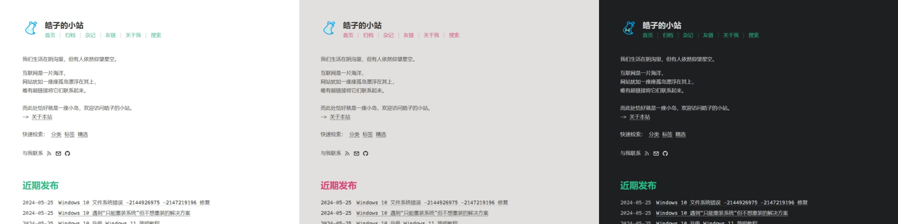
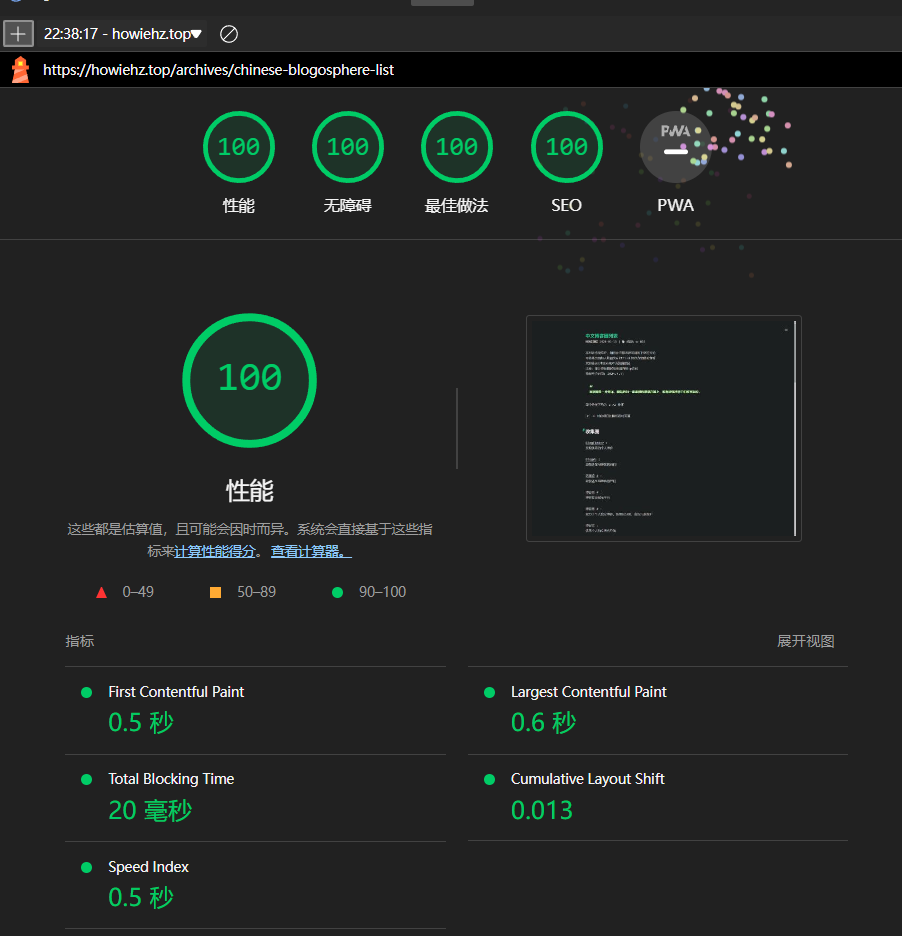

# Higan Haozi

## 说明

一款响应式、简洁清爽的个人网站 Halo CMS 主题。

想了解更多吗？欢迎访问[文档](https://howiehz.top/halo-theme-higan-haozi/)进一步了解此主题。
也可以访问[示例站点](https://howiehz.top/)进行体验。

## 特点

在简洁清爽的基础上，本主题秉持以下核心理念：

1. 响应式设计（适配不同屏幕尺寸）
2. [多语言支持](https://howiehz.top/halo-theme-higan-haozi/tutorial/i18n)
3. [强可配置性](https://howiehz.top/halo-theme-higan-haozi/guide/theme-configuration)
4. [兼容性良好](https://howiehz.top/halo-theme-higan-haozi/guide/what-is-higan-haozi#浏览器兼容性)
5. [插件兼容性](https://howiehz.top/halo-theme-higan-haozi/guide/plugin-compatibility)
6. [高性能表现](https://howiehz.top/halo-theme-higan-haozi/guide/what-is-higan-haozi#lighthouse)

## 预览

下图展示了主题部分配色风格：

## 一些话

<!-- markdownlint-disable MD013 -->

如果你喜欢这个主题，欢迎 [Star⭐](#star-history)、[Issue🐛](https://github.com/HowieHz/halo-theme-higan-hz/issues) 或 [Pull Request🔀](https://github.com/HowieHz/halo-theme-higan-hz/pulls) 支持项目迭代。
你的支持是我持续更新的最大动力！

<!-- markdownlint-enable MD013 -->

如果你愿意支持我，也欢迎进群交流，让我知道除了我自己，还有许多人在使用这个主题😀

- [主题交流群（QQ）](http://qm.qq.com/cgi-bin/qm/qr?_wv=1027&k=QCcmLkzDHUT22qP_-MVYSYDwlL_Jf55Y&authKey=KWfge330T3nQAJy96gacr8eyp8u0egY3tNGBFAnNjqdBdMJKQLp9I9efUU9aMiGM&noverify=0&group_code=694413711)

欢迎基于本项目二次开发，不论需求多么独特，只要是本主题没实现的，就欢迎你来提 [Issue](https://github.com/HowieHz/halo-theme-higan-hz/issues/new)。

最初，这个项目只是为了解决自己的一些需求。没想到现如今已有不少小伙伴在使用，并通过各种方式反馈建议，帮助我不断优化和完善。衷心感谢大家的支持与鼓励！
另外，感谢所有通过打赏支持本项目的小伙伴，特此列出名单：[赞助名单](#感谢赞助)

## Lighthouse

Lighthouse 测试结果：

## 贡献指南

见 [CONTRIBUTING](./CONTRIBUTING)

## 项目状态

### Repobeats analytics

### Star History

## 感谢赞助

点我展开赞助列表

- GreenTomato 赞助 66.66 CNY 于 2025 年 2 月 14 日
- [默小班](hhttps://www.memxb.top/) 赞助 5 CNY 于 2025 年 2 月 12 日
- [boyving](https://www.imdream.cn/) 赞助 18.80 CNY 于 2025 年 2 月 10 日
- [bilibili@氵青一色但不是清一色](https://space.bilibili.com/37264956) 赞助 5 CNY 于 2025 年 1 月 20 日
- [bilibili@氵青一色但不是清一色](https://space.bilibili.com/37264956) 赞助 5 CNY 于 2025 年 1 月 11 日

