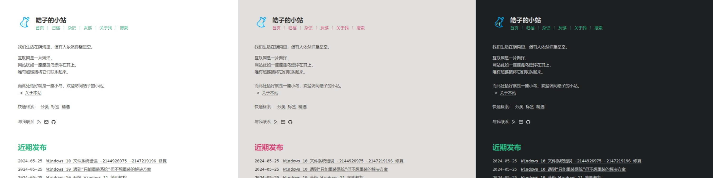

# Higan Haozi

**简体中文** | [English](./README.en.md)

## 简介

Higan Haozi 是一款响应式、简洁清爽的个人网站主题，适用于 [Halo CMS](https://github.com/halo-dev/halo)。

想了解更多吗？欢迎访问[文档](https://howiehz.top/halo-theme-higan-haozi/)进一步了解此主题。  
也可以访问[示例站点](https://howiehz.top/)进行体验。

> 👉 [快速开始](https://howiehz.top/halo-theme-higan-haozi/guide/getting-started)

## 特点

在简洁清爽的基础上，本主题秉持以下核心理念：

1. [响应式设计](https://howiehz.top/halo-theme-higan-haozi/reference/responsive-breakpoints)
2. [多语言支持](https://howiehz.top/halo-theme-higan-haozi/tutorial/i18n)
3. [强可配置性](https://howiehz.top/halo-theme-higan-haozi/guide/theme-configuration)
4. [兼容性良好](https://howiehz.top/halo-theme-higan-haozi/reference/browser-compatibility)
5. [插件兼容性](https://howiehz.top/halo-theme-higan-haozi/guide/plugin-compatibility)
6. [高性能表现](https://howiehz.top/halo-theme-higan-haozi/reference/performance)（页面主题资源 ~70 KiB（压缩后））

## 预览

本主题支持[自定义配色方案](https://howiehz.top/halo-theme-higan-haozi/tutorial/custom-theme)。下图展示了部分预设配色方案：

## 一些话

如果您觉得这个主题不错，可否点一个免费的 [Star⭐](https://github.com/HowieHz/halo-theme-higan-hz) 支持一下本项目？
也随时欢迎 [Issue🐛](https://github.com/HowieHz/halo-theme-higan-hz/issues) 或 [Pull Request🔀](https://github.com/HowieHz/halo-theme-higan-hz/pulls) 支持项目迭代。
您的支持是我持续更新的最大动力！

如果您愿意支持我，也欢迎进群交流，让我知道除了我自己，还有许多人在使用这个主题😀

- [主题交流群（QQ）](http://qm.qq.com/cgi-bin/qm/qr?_wv=1027&k=QCcmLkzDHUT22qP_-MVYSYDwlL_Jf55Y&authKey=KWfge330T3nQAJy96gacr8eyp8u0egY3tNGBFAnNjqdBdMJKQLp9I9efUU9aMiGM&noverify=0&group_code=694413711)

欢迎基于本项目二次开发，不论需求多么独特，只要是本主题没实现的，就欢迎您来提 [Issue](https://github.com/HowieHz/halo-theme-higan-hz/issues/new)。

最初，这个项目只是为了解决自己的一些需求。没想到现如今已有不少小伙伴在使用，并通过各种方式反馈建议，帮助我不断优化和完善。衷心感谢大家的支持与鼓励！
另外，感谢所有通过打赏支持本项目的小伙伴，特此列出名单：[赞助名单](#感谢赞助)

## 主题历史

- 本主题：[`HowieHz/halo-theme-higan-hz`](https://github.com/HowieHz/halo-theme-higan-hz)（2024.4.5）
- 样式移植：[`guqing/halo-theme-higan`](https://github.com/guqing/halo-theme-higan)（2019.4.16）
- 样式设计：[`probberechts/hexo-theme-cactus`](https://github.com/probberechts/hexo-theme-cactus)（2016.11.1）

❤非常感谢 [Pieter Robberechts](https://github.com/probberechts) 和 [guqing](https://github.com/guqing) 以及社区伙伴的贡献与反馈！

## Lighthouse

## 贡献指南

见[贡献指南](https://howiehz.top/halo-theme-higan-haozi/maintenance/contributing)

## 更新日志

见[更新日志](https://howiehz.top/halo-theme-higan-haozi/maintenance/changelog)

## 项目状态

### Repobeats analytics

### Star History

## 感谢赞助

点我展开赞助列表

- GreenTomato 赞助 66.66 CNY 于 2025 年 2 月 14 日
- [默小班](hhttps://www.memxb.top/) 赞助 5 CNY 于 2025 年 2 月 12 日
- [boyving](https://www.imdream.cn/) 赞助 18.80 CNY 于 2025 年 2 月 10 日
- [bilibili@氵青一色但不是清一色](https://space.bilibili.com/37264956) 赞助 5 CNY 于 2025 年 1 月 20 日
- [bilibili@氵青一色但不是清一色](https://space.bilibili.com/37264956) 赞助 5 CNY 于 2025 年 1 月 11 日

