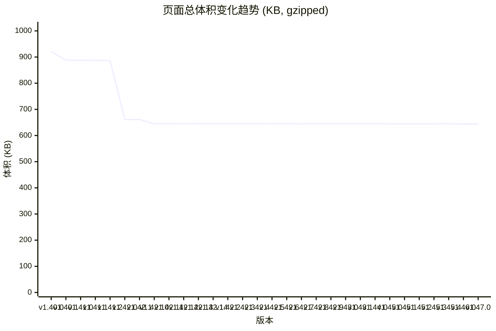

# 页面体积趋势分析

**版本范围:** v1.40.0 → 最新版本
**图表类型:** total
**生成时间:** 2025-11-21T04:39:38.764Z
**测试版本数:** 30

## 趋势图

## 详细数据

Unit: KB, Format: gzipped(original)

| 版本 | Document | Script | Stylesheet | Font | Image | Fetch | Other | Total |
|------|----------|--------|------------|------|-------|-------|-------|-------|
| v1.40.0 | 2.8(8.8) | 408.5(1245.1) | 312.3(715.5) | 0.0(0.0) | 194.6(194.4) | 2.4(1.8) | 0.6(0.2) | **921.1(2165.8)** |
| v1.40.1 | 2.8(8.6) | 375.2(1161.0) | 312.4(716.0) | 0.0(0.0) | 194.6(194.4) | 2.4(1.8) | 0.6(0.2) | **887.9(2082.1)** |
| v1.41.0 | 2.8(8.7) | 375.2(1161.0) | 312.4(716.0) | 0.0(0.0) | 194.6(194.4) | 2.4(1.8) | 0.6(0.2) | **887.9(2082.1)** |
| v1.41.1 | 2.8(8.7) | 375.2(1161.0) | 312.4(716.0) | 0.0(0.0) | 194.6(194.4) | 2.4(1.8) | 0.6(0.2) | **887.9(2082.1)** |
| v1.41.2 | 2.8(8.7) | 373.6(1159.3) | 312.1(713.4) | 0.0(0.0) | 194.6(194.4) | 2.4(1.8) | 0.6(0.2) | **886.0(2077.7)** |
| v1.42.0 | 2.9(9.0) | 295.9(930.9) | 12.3(59.6) | 152.2(152.0) | 194.6(194.4) | 2.5(2.0) | 0.6(0.2) | **661.1(1348.1)** |
| v1.42.1 | 3.4(10.3) | 296.2(931.0) | 11.9(57.5) | 152.2(152.0) | 194.6(194.4) | 2.6(2.0) | 0.6(0.2) | **661.4(1347.5)** |
| v1.42.10 | 3.4(10.3) | 279.5(880.4) | 11.8(58.1) | 152.2(152.0) | 194.6(194.4) | 2.6(2.0) | 0.6(0.2) | **644.6(1297.4)** |
| v1.42.11 | 3.4(10.3) | 279.5(880.4) | 11.8(58.1) | 152.2(152.0) | 194.6(194.4) | 2.5(2.0) | 0.6(0.2) | **644.6(1297.4)** |
| v1.42.12 | 3.4(10.2) | 280.0(882.2) | 11.6(58.4) | 152.2(152.0) | 194.6(194.4) | 2.5(2.0) | 0.6(0.2) | **644.9(1299.5)** |
| v1.42.13 | 3.4(10.4) | 280.8(882.9) | 11.3(57.7) | 152.2(152.0) | 194.6(194.4) | 2.5(2.0) | 0.6(0.2) | **645.5(1299.7)** |
| v1.42.14 | 3.4(10.5) | 279.9(882.0) | 11.3(57.7) | 152.2(152.0) | 194.6(194.4) | 2.5(2.0) | 0.6(0.2) | **644.6(1298.9)** |
| v1.42.2 | 3.4(10.2) | 279.4(880.2) | 11.9(57.6) | 152.2(152.0) | 194.6(194.4) | 2.5(2.0) | 0.6(0.2) | **644.6(1296.7)** |
| v1.42.3 | 3.4(10.2) | 279.4(880.2) | 11.9(57.6) | 152.2(152.0) | 194.6(194.4) | 2.6(2.0) | 0.6(0.2) | **644.6(1296.7)** |
| v1.42.4 | 3.4(10.2) | 279.4(880.2) | 11.9(57.6) | 152.2(152.0) | 194.6(194.4) | 2.5(2.0) | 0.6(0.2) | **644.6(1296.7)** |
| v1.42.5 | 3.4(10.3) | 279.5(880.2) | 11.9(57.6) | 152.2(152.0) | 194.6(194.4) | 2.5(2.0) | 0.6(0.2) | **644.7(1296.7)** |
| v1.42.6 | 3.4(10.3) | 279.5(880.2) | 11.9(57.6) | 152.2(152.0) | 194.6(194.4) | 2.5(2.0) | 0.6(0.2) | **644.7(1296.8)** |
| v1.42.7 | 3.4(10.3) | 279.5(880.4) | 11.6(53.8) | 152.2(152.0) | 194.6(194.4) | 2.5(2.0) | 0.6(0.2) | **644.4(1293.1)** |
| v1.42.8 | 3.4(10.3) | 279.5(880.4) | 11.7(58.0) | 152.2(152.0) | 194.6(194.4) | 2.5(2.0) | 0.6(0.2) | **644.6(1297.4)** |
| v1.42.9 | 3.4(10.3) | 279.5(880.4) | 11.8(58.1) | 152.2(152.0) | 194.6(194.4) | 2.5(2.0) | 0.6(0.2) | **644.6(1297.4)** |
| v1.43.0 | 3.4(10.5) | 279.9(882.0) | 11.3(57.7) | 152.2(152.0) | 194.6(194.4) | 2.5(2.0) | 0.6(0.2) | **644.6(1298.9)** |
| v1.43.1 | 3.4(10.4) | 279.9(882.0) | 11.3(57.7) | 152.2(152.0) | 194.6(194.4) | 2.5(2.0) | 0.6(0.2) | **644.6(1298.8)** |
| v1.44.0 | 3.4(10.4) | 279.9(882.0) | 11.3(57.7) | 152.2(152.0) | 194.6(194.4) | 2.6(2.0) | 0.6(0.2) | **644.6(1298.8)** |
| v1.45.0 | 3.4(10.2) | 279.9(882.0) | 11.3(57.7) | 152.2(152.0) | 194.6(194.4) | 2.4(1.8) | 0.6(0.2) | **644.4(1298.4)** |
| v1.45.1 | 3.4(10.2) | 279.9(882.0) | 11.3(57.7) | 152.2(152.0) | 194.6(194.4) | 2.4(1.8) | 0.6(0.2) | **644.4(1298.4)** |
| v1.45.2 | 3.4(10.2) | 279.9(882.0) | 11.3(57.7) | 152.2(152.0) | 194.6(194.4) | 2.4(1.8) | 0.6(0.2) | **644.4(1298.4)** |
| v1.45.3 | 3.4(10.2) | 279.9(882.0) | 11.4(57.8) | 152.2(152.0) | 194.6(194.4) | 2.4(1.8) | 0.6(0.2) | **644.5(1298.5)** |
| v1.45.4 | 3.4(10.2) | 279.9(882.0) | 11.4(57.8) | 152.2(152.0) | 194.6(194.4) | 2.5(1.9) | 0.6(0.2) | **644.6(1298.6)** |
| v1.46.0 | 3.4(10.2) | 279.8(881.8) | 11.2(56.4) | 152.2(152.0) | 194.6(194.4) | 2.4(1.8) | 0.6(0.2) | **644.2(1297.0)** |
| v1.47.0 | 3.4(10.2) | 279.8(881.8) | 11.2(56.4) | 152.2(152.0) | 194.6(194.4) | 2.4(1.8) | 0.6(0.2) | **644.2(1297.0)** |

## 统计摘要 (gzipped)

- **平均总体积:** 687.3 KB
- **最小总体积:** 644.2 KB
- **最大总体积:** 921.1 KB
- **体积变化:** -276.9 KB (-30.1%)

---

*此报告由 Lighthouse CI 自动生成*
