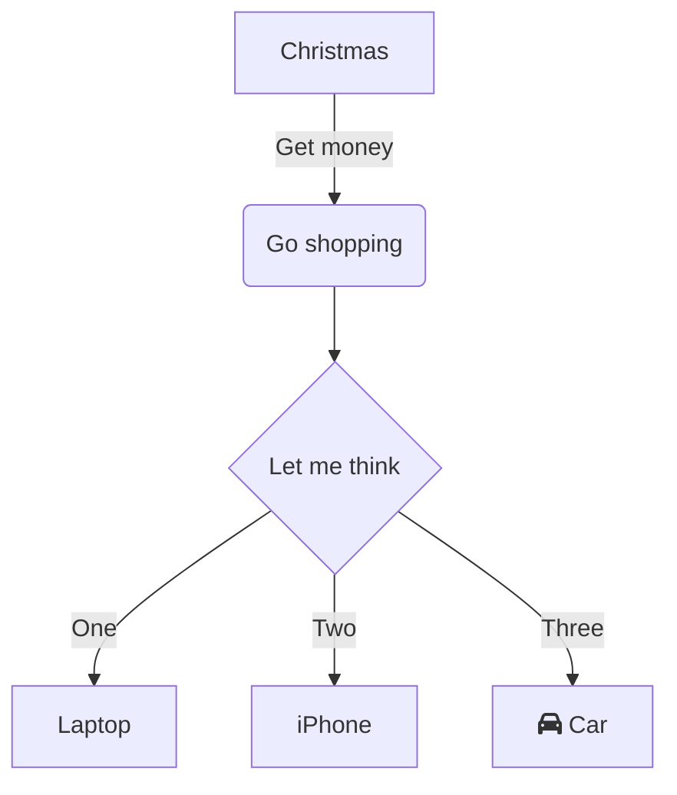
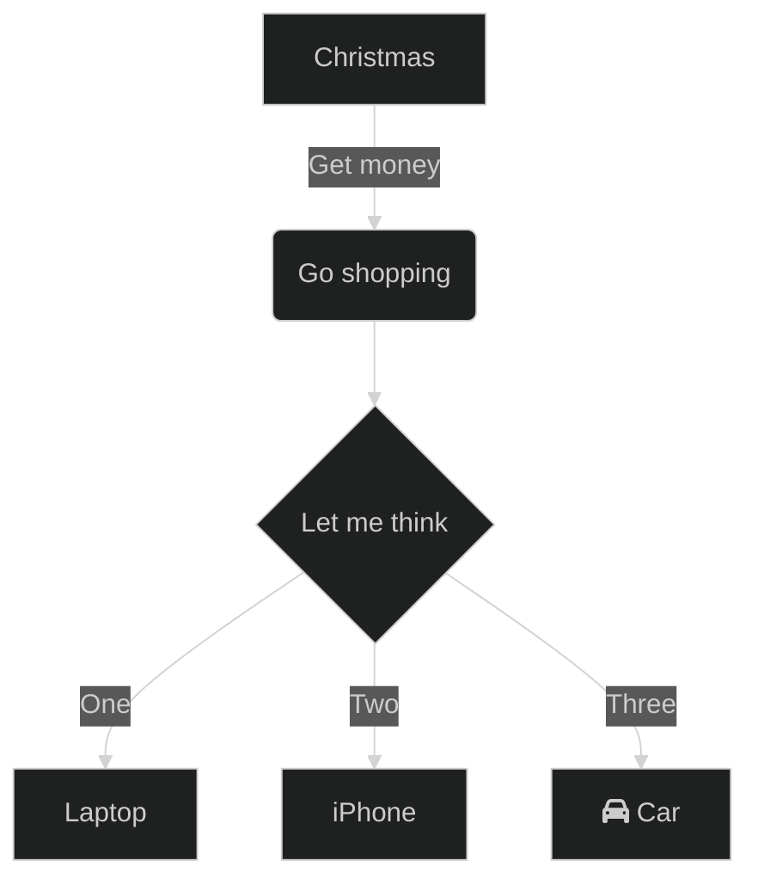

<!-- markdownlint-disable MD013 MD024 MD025 MD033 -->

# Style Reference

::: info Info

This documentation is AI-generated. You can help improve it by submitting an [Issue](https://github.com/HowieHz/halo-theme-higan-hz/issues/new).

:::

<script setup>
import DefaultRender from '../../.vitepress/components/DefaultRender.vue';
</script>

This documentation demonstrates the theme's basic styles, extended styles, and their syntax.

::: tip

The displayed styles are theme defaults; some styles can be adjusted according to actual needs.

:::

## Style Application Scope

::: details

Related Documentation: [Template Files and Access Path Mapping](/en/reference/template-map)

- <Badge type="tip" text="General Style" /> Applies to every page.
- <Badge type="tip" text="Content Style" /> Applies to `archives.html`, `category.html`, `links.html`, `moments.html`, `moment.html`, `page.html`, `photos.html`, `post.html`, `tag.html`, `5xx.html`, and `404.html`. CSS selector: `.content`.
- <Badge type="tip" text="Post Style" /> Applies to `author.html`, `links.html`, `moment.html`, `moments.html`, `page.html`, `photos.html`, `post.html`, `qrcode.html`, `5xx.html`, and `404.html`. CSS selector: `article .content`.

:::

## How to Use HTML Syntax in the Editor

::: details

- Usage in the default editor:
  1. Need to enable [Markdown / HTML Content Block Plugin](https://github.com/halo-sigs/plugin-hybrid-edit-block) ([App Store Page](https://www.halo.run/store/apps/app-NgHnY)).
  2. Type in the default editor `/html` and select to insert an HTML code block.
- Usage in Vditor editor:
  1. Need to enable [Vditor Editor Plugin](https://github.com/justice2001/halo-plugin-vditor) ([App Store Page](https://www.halo.run/store/apps/app-uBcYw)), and enter the post edit page, set the post editor to Vditor editor.
  2. Vditor editor natively supports HTML tags, just write directly.
- Usage in Willow Markdown editor:
  1. Need to enable [Willow Markdown Editor Plugin](https://github.com/guqing/willow-mde) ([App Store Page](https://www.halo.run/store/apps/app-kqZUw)), and enter the post edit page, set the post editor to Willow Markdown editor.
  2. Willow Markdown editor natively supports HTML tags, just write directly.
- Usage in ByteMD editor:
  1. Need to enable [ByteMD Editor](https://github.com/halo-sigs/plugin-bytemd) ([App Store Page](https://www.halo.run/store/apps/app-HTyhC)), and enter the post edit page, set the post editor to ByteMD editor.
  2. ByteMD editor natively supports HTML tags, just write directly.

:::

## Quick Reference for Extended Styles <Badge type="warning" text="Extended Style" />

This section lists the extended styles implemented by this theme.

- [Abbreviation](#abbreviation)
- [Responsive Video Embed](#responsive-video-embed)
- [Blockquote Footnote](#blockquote-footnote)
- [Pullquote](#pullquote)
- [Horizontal Divider (Special Style)](#horizontal-divider-special-style)
- [Hidden/Spoiler Content](#hidden-spoiler-content)
- [Light/Dark Mode Visibility Block](#light-dark-mode-visibility-block)

## Italic/Emphasis <Badge type="tip" text="General Style" />

### Italic/Emphasis Markdown Syntax

<!-- prettier-ignore-start -->
```markdown
*This is emphasized text*
_This is emphasized text_
```
<!-- prettier-ignore-end -->

### Italic/Emphasis HTML Tag Syntax

```html
<em>This is emphasized text</em>
```

### Italic/Emphasis Rendering Effect

<DefaultRender>
<em>This is emphasized text</em>
</DefaultRender>

## Bold <Badge type="tip" text="General Style" />

### Bold Markdown Syntax

<!-- prettier-ignore-start -->
```markdown
**This is bold text**
__This is bold text__
```
<!-- prettier-ignore-end -->

### Bold HTML Tag Syntax

```html
<strong>This is bold text</strong>
```

### Bold Rendering Effect

<DefaultRender>
<strong>This is bold text</strong>
</DefaultRender>

## Inline Code <Badge type="tip" text="General Style" />

### Inline Code Markdown Syntax

```markdown
`print("Hello, world!")`
```

### Inline Code HTML Tag Syntax

```html
<code>print("Hello, world!")</code>
```

### Inline Code Rendering Effect

<DefaultRender>

`print("Hello, world!")`

</DefaultRender>

## Multi-line Code Block <Badge type="tip" text="General Style" />

### Multi-line Code Block Markdown Syntax

<!-- prettier-ignore-start -->
`````markdown
```python
print("Hello, world!")
```

~~~python
print("Hello, world!")
~~~

````markdown
_Nested code block example_

```python
print("nested code block")
```
````
`````
<!-- prettier-ignore-end -->

### Multi-line Code Block Rendering Effect

The rendering effect varies with the actual renderer (such as `shiki`, `highlight.js`), so no rendering demonstration is provided.

## Paragraph <Badge type="tip" text="General Style" />

### Paragraph Markdown Syntax

```markdown
This is a regular paragraph, testing text alignment and line height.This paragraph contains some common formatting like **bold**, _italic_ and `code`. According to your CSS, this text should have appropriate line height and alignment.

This is another paragraph, this is a\
line break.

and this is not a
line break.

Two trailing spaces at the end of this line  
will also create a line break.

Empty lines are not displayed by default. If you enable `Post Page Styles - Post Page Styles - Optimize Empty Line Display in Article Paragraphs`, empty lines will be displayed.
```

### Paragraph HTML Tag Syntax

<!-- prettier-ignore-start -->
```html
<p>This is a regular paragraph that tests text alignment and line height. This paragraph contains common formatting such as <strong>bold</strong>, <em>italic</em>, and <code>code</code>. According to your CSS, this text should have appropriate line height and alignment.</p>
```
<!-- prettier-ignore-end -->

### Paragraph Rendering Effect

<DefaultRender height="325px">

This is a regular paragraph, testing text alignment and line height.This paragraph contains some common formatting like **bold**, _italic_ and `code`. According to your CSS, this text should have appropriate line height and alignment.

This is another paragraph, this is a\
line break.

and this is not a
line break.

Also, two spaces at the end of this line  
will also create a line break.

Empty lines are not displayed by default. If you enable `Post Page Styles - Post Page Styles - Optimize Empty Line Display in Article Paragraphs`, empty lines will be displayed.

</DefaultRender>

## Citation Source <Badge type="tip" text="General Style" />

### Citation Source HTML Tag Syntax

```html
From<cite>"Documentation Writing Guide"</cite>

From <cite>Documentation Writing Guide</cite>
```

### Citation Source Rendering Effect

<DefaultRender>

From<cite>"Documentation Writing Guide"</cite>

From <cite>Documentation Writing Guide</cite>

</DefaultRender>

## Superscript and Subscript <Badge type="tip" text="General Style" />

### Superscript and Subscript HTML Tag Syntax

<!-- prettier-ignore-start -->
```html
Normal text<sup>superscript<sup>super superscript<sup>super super superscript<sup>super super super superscript</sup></sup></sup></sup>
Normal text<sub>subscript<sub>sub subscript<sub>sub sub subscript<sub>sub sub sub subscript</sub></sub></sub></sub>

Normal text<sup>superscript</sup>and<sub>subscript</sub>
```
<!-- prettier-ignore-end -->

### Superscript and Subscript Rendering Effect

<DefaultRender height="100px">

Normal text<sup>superscript<sup>super superscript<sup>super super superscript<sup>super super super superscript</sup></sup></sup></sup>
Normal text<sub>subscript<sub>sub subscript<sub>sub sub subscript<sub>sub sub sub subscript</sub></sub></sub></sub>

Normal text<sup>superscript</sup>and<sub>subscript</sub>

</DefaultRender>

## Small Text <Badge type="tip" text="General Style" />

### Small Text HTML Tag Syntax

<!-- prettier-ignore-start -->
```html
This is Normal text <small>This is small text</small> This is Normal text

This is normal text <small>This is small text</small> This is normal text
```
<!-- prettier-ignore-end -->

### Small Text Rendering Effect

<DefaultRender>

This is Normal text <small>This is small text</small> This is Normal text

This is normal text <small>This is small text</small> This is normal text

</DefaultRender>

## Abbreviation <Badge type="tip" text="General Style" /> <Badge type="warning" text="Extended Style" /> {#abbreviation}

### Abbreviation HTML Tag Syntax

<!-- prettier-ignore-start -->
```html
This text contains an abbreviation, hover over it on devices that support hovering to see the tooltip:<abbr title="Hypertext Markup Language">HTML</abbr>

When <strong>the device does not support hover</strong> or the page is in <strong>print mode</strong>, the full term is displayed in parentheses after the abbreviation.
For example, on touch devices, the above "HTML" will automatically display as "HTML(Hypertext Markup Language)".

<abbr title="Hypertext Markup Language"><a href="https://example.com">HTML - This line will apply both a tag styles in posts, so there are two layers of underline</a></abbr>

<abbr title="I am a tooltip">This tag has a title attribute, so hovering over it will show a tooltip.</abbr>

<abbr>Actually <abbr>title</abbr> is optional</abbr>

<abbr>One layer <abbr>Two layers <abbr>Three layers <abbr>Four layers abbr tag nesting test </abbr></abbr></abbr></abbr>
```
<!-- prettier-ignore-end -->

### Abbreviation Rendering Effect

<DefaultRender height="300px">

This text contains an abbreviation, hover over it on devices that support hovering to see the tooltip:<abbr title="Hypertext Markup Language">HTML</abbr>

When <strong>the device does not support hover</strong> or the page is in <strong>print mode</strong>, the full term is displayed in parentheses after the abbreviation.
For example, on touch devices, the "HTML" above is displayed as "HTML (Hypertext Markup Language)".

<abbr title="Hypertext Markup Language"><a href="https://example.com">HTML - This line will apply both a tag styles in posts, so there are two layers of underline</a></abbr>

<abbr title="I am a tooltip">This tag has a title attribute, so hovering over it will show a tooltip.</abbr>

<abbr>Actually <abbr>title</abbr> is optional</abbr>

<abbr>One layer <abbr>Two layers <abbr>Three layers <abbr>Four layers abbr tag nesting test </abbr></abbr></abbr></abbr>

</DefaultRender>

## Heading <Badge type="tip" text="General Style" />

### Heading Markdown Syntax

<!-- prettier-ignore-start -->
```markdown
# Heading 1
## Heading 2
### Heading 3
#### Heading 4
##### Heading 5
###### Heading 6
```
<!-- prettier-ignore-end -->

### Heading HTML Tag Syntax

```html
<h1>Heading 1</h1>
<h2>Heading 2</h2>
<h3>Heading 3</h3>
<h4>Heading 4</h4>
<h5>Heading 5</h5>
<h6>Heading 6</h6>
```

### Heading HTML Class Syntax

```html
<div class="h1">Text using the h1 class</div>
<div class="h2">Text using the h2 class</div>
```

### Heading Rendering Effect

<DefaultRender height="300px">

<h1>Heading 1</h1>
<h2>Heading 2</h2>
<h3>Heading 3</h3>
<h4>Heading 4</h4>
<h5>Heading 5</h5>
<h6>Heading 6</h6>
<div class="h1">Text using the h1 class</div>
<div class="h2">Text using the h2 class</div>

</DefaultRender>

## Post Heading Style <Badge type="tip" text="Post Style" />

Heading anchor links are available on post and single page templates: hovering over or focusing a heading reveals a clickable `#` before it; clicking navigates to that heading's anchor and updates the address bar URL. h2 headings display the anchor permanently; all other levels show it on hover or focus. On mobile (screen width below 640px), the anchor appears to the right of the heading text instead.

### Post Heading Style Markdown Syntax

```markdown
## Heading 2

### Heading 3

#### Heading 4

##### Heading 5

###### Heading 6
```

### Post Heading Style HTML Tag Syntax

```html
<h2>Heading 2</h2>
<h3>Heading 3</h3>
<h4>Heading 4</h4>
<h5>Heading 5</h5>
<h6>Heading 6</h6>
```

### Post Heading Style Rendering Effect

<DefaultRender src="/halo-theme-higan-haozi/frames/post" height="300px">

<h2>Heading 2</h2>
<h3>Heading 3</h3>
<h4>Heading 4</h4>
<h5>Heading 5</h5>
<h6>Heading 6</h6>

</DefaultRender>

## Link in Heading <Badge type="tip" text="General Style" />

### Link in Heading Markdown Syntax

<!-- prettier-ignore-start -->
```markdown
# [Link in Heading 1](https://howiehz.top)
## [Link in Heading 2](https://howiehz.top)
### [Link in Heading 3](https://howiehz.top)
#### [Link in Heading 4](https://howiehz.top)
##### [Link in Heading 5](https://howiehz.top)
###### [Link in Heading 6](https://howiehz.top)
```
<!-- prettier-ignore-end -->

### Link in Heading HTML Tag Syntax

```html
<h1><a href="https://howiehz.top">Link in Heading 1</a></h1>
<h2><a href="https://howiehz.top">Link in Heading 2</a></h2>
<h3><a href="https://howiehz.top">Link in Heading 3</a></h3>
<h4><a href="https://howiehz.top">Link in Heading 4</a></h4>
<h5><a href="https://howiehz.top">Link in Heading 5</a></h5>
<h6><a href="https://howiehz.top">Link in Heading 6</a></h6>
```

### Link in Heading HTML Class Syntax

```html
<div class="h1"><a href="https://example.com">Link in an h1 class element</a></div>
<div class="h2"><a href="https://example.com">Link in an h2 class element</a></div>
```

### Link in Heading Rendering Effect

<DefaultRender height="300px">

<h1><a href="https://howiehz.top">Link in Heading 1</a></h1>
<h2><a href="https://howiehz.top">Link in Heading 2</a></h2>
<h3><a href="https://howiehz.top">Link in Heading 3</a></h3>
<h4><a href="https://howiehz.top">Link in Heading 4</a></h4>
<h5><a href="https://howiehz.top">Link in Heading 5</a></h5>
<h6><a href="https://howiehz.top">Link in Heading 6</a></h6>
<div class="h1"><a href="https://example.com">Link in an h1 class element</a></div>
<div class="h2"><a href="https://example.com">Link in an h2 class element</a></div>
</DefaultRender>

## Link <Badge type="tip" text="Content Style" />

### Link Markdown Syntax

```markdown
[This is a regular link](https://example.com) with an underline effect. The underline color changes on hover.
```

### Link HTML Tag Syntax

```html
<a href="https://example.com">This is a regular link</a> with an underline effect. The underline color changes on hover.
```

### Link Rendering Effect

<DefaultRender>

[This is a regular link](https://example.com) with an underline effect. The underline color changes on hover.

</DefaultRender>

## Icon Link <Badge type="tip" text="Content Style" />

<!-- prettier-ignore-start -->
```html
<a class="icon" href="javascript:void(0);">This anchor uses `class="icon"` for icon-style links: no underline, with a color change on hover.</a>
```
<!-- prettier-ignore-end -->

### Icon Link Rendering Effect

<DefaultRender>
<a class="icon" href="javascript:void(0);">This anchor uses `class="icon"` for icon-style links: no underline, with a color change on hover.</a>
</DefaultRender>

## Image Embed <Badge type="tip" text="Post Style" />

### Image Embed Markdown Syntax

```markdown


```

### Image Embed HTML Tag Syntax

```html
<p>
  
</p>

<p>
  
</p>

<p>
  
</p>
```

### Image Embed Rendering Effect

<DefaultRender height="300px" src="/halo-theme-higan-haozi/frames/post">


</DefaultRender>

## Caption <Badge type="tip" text="Post Style" />

### Caption HTML Tag Syntax

<!-- prettier-ignore-start -->
```html
<p></p>

<div class="caption">This is image caption text. The image above shows a city skyline at night.</div>
<figcaption>This is image caption text. The image above shows a city skyline at night.</figcaption>
<div class="caption">This is also image caption text with <a href="https://probberechts.github.io/hexo-theme-cactus/cactus-dark/public/assets/wallpaper-2572384.jpg">a link</a>.</div>
<figcaption>This is also image caption text with <a href="https://probberechts.github.io/hexo-theme-cactus/cactus-dark/public/assets/wallpaper-2572384.jpg">a link</a>.</figcaption>
```

<!-- prettier-ignore-end -->

### Caption Rendering Effect

<DefaultRender height="400px" src="/halo-theme-higan-haozi/frames/post">
<p></p>

<div class="caption">This is image caption text. The image above shows a city skyline at night.</div>
<figcaption>This is image caption text. The image above shows a city skyline at night.</figcaption>
<div class="caption">This is also image caption text with <a href="https://probberechts.github.io/hexo-theme-cactus/cactus-dark/public/assets/wallpaper-2572384.jpg">a link</a>.</div>
<figcaption>This is also image caption text with <a href="https://probberechts.github.io/hexo-theme-cactus/cactus-dark/public/assets/wallpaper-2572384.jpg">a link</a>.</figcaption>
</DefaultRender>

## Responsive Video Embed <Badge type="tip" text="Post Style" /> <Badge type="warning" text="Extended Style" /> {#responsive-video-embed}

### Responsive Video Embed HTML Tag Syntax

::: tip

Wrap the embed in `<div class="video-container"></div>` so the video scales down with the page width. This approach is based on [CSS: Elastic Videos - Web Designer Wall](https://webdesignerwall.com/tutorials/css-elastic-videos).

:::

```html
<div class="video-container">
  <iframe
    src="https://player.bilibili.com/player.html?bvid=BV1A7QWY3EkW&autoplay=0&poster=1&muted=1&danmaku=0"
    width="100%"
    height="500"
    scrolling="no"
    frameborder="0"
    framespacing="0"
    allowfullscreen="true"
    sandbox="allow-top-navigation allow-same-origin allow-forms allow-scripts"
  ></iframe>
</div>
```

### Responsive Video Embed Rendering Effect

<DefaultRender height="400px" src="/halo-theme-higan-haozi/frames/post">
<div class="video-container">
  <iframe
    src="https://player.bilibili.com/player.html?bvid=BV1A7QWY3EkW&autoplay=0&poster=1&muted=1&danmaku=0"
    width="100%"
    height="500"
    scrolling="no"
    frameborder="0"
    framespacing="0"
    allowfullscreen="true"
    sandbox="allow-top-navigation allow-same-origin allow-forms allow-scripts"
  ></iframe>
</div>
</DefaultRender>

## Blockquote <Badge type="tip" text="Post Style" />

### Blockquote Markdown Syntax

```markdown
> Quoted content

> This is quoted content
>
> > This is nested quoted content
>
> This quoted content returns to the first level
```

### Blockquote Rendering Effect

<DefaultRender height="400px" src="/halo-theme-higan-haozi/frames/post">

<!-- markdownlint-disable MD028 -->

> Quoted content

> This is quoted content
>
> > This is nested quoted content
>
> This quoted content returns to the first level

<!-- markdownlint-enable MD028 -->

</DefaultRender>

## Blockquote Footnote <Badge type="tip" text="Post Style" /> <Badge type="warning" text="Extended Style" /> {#blockquote-footnote}

### Blockquote Footnote Markdown Syntax

```markdown
> Quoted content
>
> <footer>Footnote information</footer>

> Quoted content
>
> <footer><cite>Author name</cite></footer>

> Quoted content
>
> <footer><a href="https://example.com">Author homepage</a></footer>

> This blockquote uses a specific color and font weight.
>
> <footer><a href="https://example.com">Author link</a><cite>Author name</cite></footer>
```

### Blockquote Footnote Rendering Effect

<DefaultRender height="600px" src="/halo-theme-higan-haozi/frames/post">

<!-- markdownlint-disable MD028 -->

> Quoted content
>
> <footer>Footnote information</footer>

> Quoted content
>
> <footer><cite>Author name</cite></footer>

> Quoted content
>
> <footer><a href="https://example.com">Author homepage</a></footer>

> This blockquote uses a specific color and font weight.
>
> <footer><a href="https://example.com">Author link</a><cite>Author name</cite></footer>

<!-- markdownlint-enable MD028 -->

</DefaultRender>

## Pullquote <Badge type="tip" text="Post Style" /> <Badge type="warning" text="Extended Style" /> {#pullquote}

### Pullquote HTML Tag Syntax

<!-- prettier-ignore-start -->
```html
<div style="clear: both">

This is sample body text, exactly as you would expect: plain text for testing layout. This is sample body text, exactly as you would expect: plain text for testing layout. This is sample body text, exactly as you would expect: plain text for testing layout. This is sample body text, exactly as you would expect: plain text for testing layout.

<blockquote class="pullquote">

This is pullquote text. This is pullquote text. This is pullquote text. This is pullquote text. This is pullquote text. This is pullquote text. This is pullquote text.

</blockquote>

This is more sample body text, exactly as you would expect: plain text for testing layout. This is more sample body text, exactly as you would expect: plain text for testing layout. This is more sample body text, exactly as you would expect: plain text for testing layout. This is more sample body text, exactly as you would expect: plain text for testing layout.

<blockquote class="pullquote left">

This is a left-aligned pullquote. This is a left-aligned pullquote. This is a left-aligned pullquote. This is a left-aligned pullquote. This is a left-aligned pullquote. This is a left-aligned pullquote. This is a left-aligned pullquote.

</blockquote>

This main text wraps around the pullquote on the left. It is long enough to show how surrounding text flows beside the floated quote. The quote occupies 45% of the available width, and the remaining text fills the rest of the line. This main text wraps around the pullquote on the left. It is long enough to show how surrounding text flows beside the floated quote. The quote occupies 45% of the available width, and the remaining text fills the rest of the line.

<blockquote class="pullquote right">

This is a right-aligned pullquote. This is a right-aligned pullquote. This is a right-aligned pullquote. This is a right-aligned pullquote. This is a right-aligned pullquote. This is a right-aligned pullquote. This is a right-aligned pullquote.

</blockquote>

This is another paragraph wrapping around a pullquote on the right. It also needs enough length to make the wrapping behavior visible. Right-aligned pullquotes use their own margin settings. This is another paragraph wrapping around a pullquote on the right. It also needs enough length to make the wrapping behavior visible. Right-aligned pullquotes use their own margin settings. This is another paragraph wrapping around a pullquote on the right. It also needs enough length to make the wrapping behavior visible.

</div>
```
<!-- prettier-ignore-end -->

### Pullquote Rendering Effect

<DefaultRender height="500px" src="/halo-theme-higan-haozi/frames/post">
<div style="clear: both">

This is sample body text, exactly as you would expect: plain text for testing layout. This is sample body text, exactly as you would expect: plain text for testing layout. This is sample body text, exactly as you would expect: plain text for testing layout. This is sample body text, exactly as you would expect: plain text for testing layout.

<blockquote class="pullquote">

This is pullquote text. This is pullquote text. This is pullquote text. This is pullquote text. This is pullquote text. This is pullquote text. This is pullquote text.

</blockquote>

This is more sample body text, exactly as you would expect: plain text for testing layout. This is more sample body text, exactly as you would expect: plain text for testing layout. This is more sample body text, exactly as you would expect: plain text for testing layout. This is more sample body text, exactly as you would expect: plain text for testing layout.

<blockquote class="pullquote left">

This is a left-aligned pullquote. This is a left-aligned pullquote. This is a left-aligned pullquote. This is a left-aligned pullquote. This is a left-aligned pullquote. This is a left-aligned pullquote. This is a left-aligned pullquote.

</blockquote>

This main text wraps around the pullquote on the left. It is long enough to show how surrounding text flows beside the floated quote. The quote occupies 45% of the available width, and the remaining text fills the rest of the line. This main text wraps around the pullquote on the left. It is long enough to show how surrounding text flows beside the floated quote. The quote occupies 45% of the available width, and the remaining text fills the rest of the line.

<blockquote class="pullquote right">

This is a right-aligned pullquote. This is a right-aligned pullquote. This is a right-aligned pullquote. This is a right-aligned pullquote. This is a right-aligned pullquote. This is a right-aligned pullquote. This is a right-aligned pullquote.

</blockquote>

This is another paragraph wrapping around a pullquote on the right. It also needs enough length to make the wrapping behavior visible. Right-aligned pullquotes use their own margin settings. This is another paragraph wrapping around a pullquote on the right. It also needs enough length to make the wrapping behavior visible. Right-aligned pullquotes use their own margin settings. This is another paragraph wrapping around a pullquote on the right. It also needs enough length to make the wrapping behavior visible.

</div>
</DefaultRender>

## Unordered List <Badge type="tip" text="General Style" />

### Unordered List Markdown Syntax

```markdown
- First list item
- Second list item
  - Nested list item
  - Another nested list item
- Third list item
```

### Unordered List HTML Tag Syntax

```html
<ul>
  <li>First list item</li>
  <li>
    Second list item
    <ul>
      <li>Nested list item</li>
      <li>Another nested list item</li>
    </ul>
  </li>
  <li>Third list item</li>
</ul>
```

### Unordered List Rendering Effect

<DefaultRender height="250px">

- First list item
- Second list item
  - Nested list item
  - Another nested list item
- Third list item

</DefaultRender>

## Ordered List <Badge type="tip" text="General Style" />

### Ordered List Markdown Syntax

```markdown
1. First item
2. Second item
   1. Nested ordered item
   2. Another nested ordered item
3. Third item
```

### Ordered List HTML Tag Syntax

```html
<ol>
  <li>First item</li>
  <li>
    Second item
    <ol>
      <li>Nested ordered item</li>
      <li>Another nested ordered item</li>
    </ol>
  </li>
  <li>Third item</li>
</ol>
```

### Ordered List Rendering Effect

<DefaultRender height="250px">

1. First item
2. Second item
   1. Nested ordered item
   2. Another nested ordered item
3. Third item

</DefaultRender>

## Definition List <Badge type="tip" text="General Style" />

### Definition List HTML Tag Syntax

```html
<dl>
  <dt>Term one</dt>
  <dd>Definition for term one</dd>
  <dt>Term two</dt>
  <dd>Definition for term two</dd>
</dl>
```

### Definition List Rendering Effect

<DefaultRender height="250px">
<dl>
    <dt>Term one</dt>
    <dd>Definition for term one</dd>
    <dt>Term two</dt>
    <dd>Definition for term two</dd>
</dl>
</DefaultRender>

## Table <Badge type="tip" text="General Style" />

### Table Markdown Syntax

```markdown
| Algorithm   | Average Time Complexity | Space Complexity |
| ----------- | ----------------------- | ---------------- |
| Bubble Sort | O(n^2)                  | O(1)             |
| Merge Sort  | O(n log n)              | O(n)             |
| Quick Sort  | O(n log n)              | O(log n)         |
```

### Table HTML Tag Syntax

```html
<table>
  <thead>
    <tr>
      <th><p>Algorithm</p></th>
      <th><p>Average Time Complexity</p></th>
      <th><p>Space Complexity</p></th>
    </tr>
  </thead>
  <tbody>
    <tr>
      <td><p>Bubble Sort</p></td>
      <td><p>O(n^2)</p></td>
      <td><p>O(1)</p></td>
    </tr>
    <tr>
      <td><p>Merge Sort</p></td>
      <td><p>O(n\log n)</p></td>
      <td><p>O(n)</p></td>
    </tr>
    <tr>
      <td><p>Quick Sort</p></td>
      <td><p>O(n\log n)</p></td>
      <td><p>O(\log n)</p></td>
    </tr>
  </tbody>
</table>
```

### Table Rendering Effect

<DefaultRender height="200px">

| Algorithm   | Average Time Complexity | Space Complexity |
| ----------- | ----------------------- | ---------------- |
| Bubble Sort | O(n^2)                  | O(1)             |
| Merge Sort  | O(n log n)              | O(n)             |
| Quick Sort  | O(n log n)              | O(log n)         |

</DefaultRender>

## Horizontal Divider <Badge type="tip" text="General Style" />

### Horizontal Divider Markdown Syntax

```markdown
---
```

### Horizontal Divider HTML Tag Syntax

```html
<hr />
```

### Horizontal Divider Rendering Effect

<DefaultRender>

---

</DefaultRender>

## Horizontal Divider (Special Style) <Badge type="tip" text="General Style" /> <Badge type="warning" text="Extended Style" /> {#horizontal-divider-special-style}

### Horizontal Divider (Special Style) HTML Class Syntax

```html
<hr class="divide" />
```

### Horizontal Divider (Special Style) Rendering Effect

<DefaultRender>
<hr class='divide' />
</DefaultRender>

## Hidden/Spoiler <Badge type="tip" text="General Style" /> <Badge type="warning" text="Extended Style" /> {#hidden-spoiler-content}

### Hidden/Spoiler HTML Tag Syntax

<!-- prettier-ignore-start -->
```html
This text is visible. <hide class="blur">This hidden content should use the blur style.</hide> This text is also visible.
This text is visible. <spoiler class="blur">This hidden content should use the blur style.</spoiler> This text is also visible.

This text is visible. <hide class="black">This hidden content should use the black block style.</hide> This text is also visible.
This text is visible. <spoiler class="black">This hidden content should use the black block style.</spoiler> This text is also visible.

This text is visible. <hide>This hidden content is revealed on hover, focus, or text selection.</hide> This text is also visible.
This text is visible. <spoiler>This hidden content is revealed on hover, focus, or text selection.</spoiler> This text is also visible.
```
<!-- prettier-ignore-end -->

### Hidden/Spoiler Rendering Effect

<DefaultRender height="250px">

This text is visible. <hide class="blur">This hidden content should use the blur style.</hide> This text is also visible.
This text is visible. <spoiler class="blur">This hidden content should use the blur style.</spoiler> This text is also visible.

This text is visible. <hide class="black">This hidden content should use the black block style.</hide> This text is also visible.
This text is visible. <spoiler class="black">This hidden content should use the black block style.</spoiler> This text is also visible.

This text is visible. <hide>This hidden content is revealed on hover, focus, or text selection.</hide> This text is also visible.
This text is visible. <spoiler>This hidden content is revealed on hover, focus, or text selection.</spoiler> This text is also visible.

</DefaultRender>

## Long Word Test <Badge type="tip" text="Content Style" />

### Long Word Test HTML Tag Syntax

<!-- prettier-ignore-start -->
```html
<p>This paragraph uses hyphens: auto to demonstrate automatic hyphenation. Supercalifragilisticexpialidocious is a very long English word that can be hyphenated in narrow containers. Pneumonoultramicroscopicsilicovolcanoconiosis is another long-word example. An extremely long English word</p>

<code>This text uses hyphens: manual and does not apply automatic hyphenation. Supercalifragilisticexpialidocious is a very long English word that will not be automatically hyphenated. Pneumonoultramicroscopicsilicovolcanoconiosis is another long-word example. An extremely long English word</code>
```
<!-- prettier-ignore-end -->

### Long Word Test Rendering Result

<DefaultRender height="300px">

<p>This paragraph uses hyphens: auto to demonstrate automatic hyphenation. Supercalifragilisticexpialidocious is a very long English word that can be hyphenated in narrow containers. Pneumonoultramicroscopicsilicovolcanoconiosis is another long-word example. An extreme&shy;ly long English word</p>

<code>This text uses hyphens: manual and does not apply automatic hyphenation. Supercalifragilisticexpialidocious is a very long English word that will not be automatically hyphenated. Pneumonoultramicroscopicsilicovolcanoconiosis is another long-word example. An extreme&shy;ly long English word</code>

</DefaultRender>

## Light/Dark Mode Visibility Block <Badge type="tip" text="Post Style" /> <Badge type="warning" text="Extended Style" /> {#light-dark-mode-visibility-block}

```html
<div class="light">
  This content is shown only in light mode or auto mode when the light theme is active. Try switching the page theme.
</div>
<div class="dark">
  This content is shown only in dark mode or auto mode when the dark theme is active. Try switching the page theme.
</div>
```

### Light/Dark Mode Visibility Block Rendering Effect

<DefaultRender src="/halo-theme-higan-haozi/frames/post">
<div class="light">This content is shown only in light mode or auto mode when the light theme is active. Try switching the page theme.</div>
<div class="dark">This content is shown only in dark mode or auto mode when the dark theme is active. Try switching the page theme.</div>
</DefaultRender>

### Mermaid Light/Dark Theme Adaptation {#mermaid-light-dark-theme-adaptation}

#### Default Editor

::: details Method 1: Code block
Enable [Mermaid Support](/en/guide/theme-configuration#mermaid-support).  
In the default editor, insert a Code Block by typing `/` and selecting Code Block, set the language to `Mermaid`, and enter the diagram source as usual.  
The theme automatically generates both light and dark versions of the diagram.  
Notes:

- If you use a code-highlighting plugin such as [Shiki](https://www.halo.run/store/apps/app-kzloktzn), exclude Mermaid in that plugin's settings.

:::

::: details Method 2: Text Diagram plugin
Enable [Mermaid Support](/en/guide/theme-configuration#mermaid-support).  
Enable the [Text Diagram plugin](https://www.halo.run/store/apps/app-ahBRi).  
In the default editor, insert a Text Diagram block by typing `/` and selecting Text Diagram, set the language to `Mermaid`, and enter the diagram source as usual.  
The theme automatically generates both light and dark versions of the diagram.

:::

::: details Method 3: HTML syntax with automatic light/dark rendering
Enable [Mermaid Support](/en/guide/theme-configuration#mermaid-support).  
This method uses HTML syntax. See [How to Use HTML Syntax in the Editor](#how-to-use-html-syntax-in-the-editor).  
Write the diagram once; the theme automatically generates both light and dark versions.

Example:

<!-- prettier-ignore-start -->
```html
<div class="auto">
flowchart TD
    A[Christmas] -->|Get money| B(Go shopping)
    B --> C{Let me think}
    C -->|One| D[Laptop]
    C -->|Two| E[iPhone]
    C -->|Three| F[fa:fa-car Car]
</div>
```
<!-- prettier-ignore-end -->

:::
::: details Method 4: HTML syntax with manually managed light/dark diagrams
Enable [Mermaid Support](/en/guide/theme-configuration#mermaid-support).  
This method uses HTML syntax. See [How to Use HTML Syntax in the Editor](#how-to-use-html-syntax-in-the-editor).  
Manually maintain separate diagrams for light and dark modes.

Example:

<!-- prettier-ignore-start -->
```html
<div class="dark">
%%{init: { "theme": "dark" } }%%
flowchart TD
    A[Christmas] -->|Get money| B(Go shopping)
    B --> C{Let me think}
    C -->|One| D[Laptop]
    C -->|Two| E[iPhone]
    C -->|Three| F[fa:fa-car Car]
</div>

<div class="light">
%%{init: { "theme": "light" } }%%
flowchart TD
    A[Christmas] -->|Get money| B(Go shopping)
    B --> C{Let me think}
    C -->|One| D[Laptop]
    C -->|Two| E[iPhone]
    C -->|Three| F[fa:fa-car Car]
</div>
```
<!-- prettier-ignore-end -->

:::

#### Vditor Editor

Enable the [Vditor Editor plugin](https://www.halo.run/store/apps/app-uBcYw), then switch the post editor to Vditor.

<!-- Vditor renders Markdown as div.language-mermaid instead of pre > code.language-mermaid, so both the theme and the Vditor editor can take precedence over Shiki rendering. The theme also takes precedence over the Vditor editor, so neither the Vditor editor renderer nor the Shiki exclude setting needs to be enabled. -->

::: details Method 1: Markdown syntax with automatic light/dark rendering
Enable [Mermaid Support](/en/guide/theme-configuration#mermaid-support).

Example:

<!-- prettier-ignore-start -->
````markdown

````
<!-- prettier-ignore-end -->

As shown above, write the diagram using the standard Markdown code block syntax.

:::

::: details Method 2: HTML syntax with automatic light/dark rendering
Enable [Mermaid Support](/en/guide/theme-configuration#mermaid-support).  
Write the diagram once; the theme automatically generates both light and dark versions.

Example:

<!-- prettier-ignore-start -->
````html
<div class="auto">


</div>
````
<!-- prettier-ignore-end -->

:::

::: details Method 3: HTML syntax with manually managed light/dark diagrams
Enable [Mermaid Support](/en/guide/theme-configuration#mermaid-support).  
Manually maintain separate diagrams for light and dark modes.

Example:

<!-- prettier-ignore-start -->
````html
<div class="dark">



</div>

<div class="light">


</div>
````
<!-- prettier-ignore-end -->

:::

#### Willow Markdown Editor

Enable the [Willow Markdown Editor plugin](https://www.halo.run/store/apps/app-kqZUw), then switch the post editor to Willow Markdown.

Notes:

- If you use a code-highlighting plugin such as [Shiki](https://www.halo.run/store/apps/app-kzloktzn), exclude Mermaid in that plugin's settings.

<!-- Markdown rendering outputs pre > code.hljs.language-mermaid, and the theme cannot take precedence over Shiki. -->

::: details Method 1: Markdown syntax with automatic light/dark rendering
Enable [Mermaid Support](/en/guide/theme-configuration#mermaid-support).

Example:

<!-- prettier-ignore-start -->
````markdown

````
<!-- prettier-ignore-end -->

As shown above, write the diagram using the standard Markdown code block syntax.

:::

::: details Method 2: HTML syntax with automatic light/dark rendering
Enable [Mermaid Support](/en/guide/theme-configuration#mermaid-support).  
Write the diagram once; the theme automatically generates both light and dark versions.

Example:

<!-- prettier-ignore-start -->
````html
<div class="auto">


</div>
````
<!-- prettier-ignore-end -->

:::

::: details Method 3: HTML syntax with manually managed light/dark diagrams
Enable [Mermaid Support](/en/guide/theme-configuration#mermaid-support).  
Manually maintain separate diagrams for light and dark modes.

Example:

<!-- prettier-ignore-start -->
````html
<div class="dark">


</div>

<div class="light">


</div>
````
<!-- prettier-ignore-end -->

:::

#### ByteMD Editor

Enable the [ByteMD Editor plugin](https://www.halo.run/store/apps/app-HTyhC), then switch the post editor to ByteMD.

Notes:

- If you use a code-highlighting plugin such as [Shiki](https://www.halo.run/store/apps/app-kzloktzn), exclude Mermaid in that plugin's settings.

<!-- Markdown rendering outputs pre > code.language-mermaid, and the theme cannot take precedence over Shiki. -->

::: details Method 1: Markdown syntax with automatic light/dark rendering
Enable [Mermaid Support](/en/guide/theme-configuration#mermaid-support).

Example:

<!-- prettier-ignore-start -->
````markdown

````
<!-- prettier-ignore-end -->

As shown above, write the diagram using the standard Markdown code block syntax.

:::

::: details Method 2: HTML syntax with automatic light/dark rendering
Enable [Mermaid Support](/en/guide/theme-configuration#mermaid-support).  
Write the diagram once; the theme automatically generates both light and dark versions.

Example:

<!-- prettier-ignore-start -->
````html
<div class="auto">


</div>
````
<!-- prettier-ignore-end -->

:::

::: details Method 3: HTML syntax with manually managed light/dark diagrams
Enable [Mermaid Support](/en/guide/theme-configuration#mermaid-support).  
Manually maintain separate diagrams for light and dark modes.

Example:

<!-- prettier-ignore-start -->
````html
<div class="dark">


</div>

<div class="light">


</div>
````
<!-- prettier-ignore-end -->

:::

#### StackEdit Editor

Enable the [StackEdit Editor plugin](https://www.halo.run/store/apps/app-hDXMG), then switch the post editor to StackEdit.

Notes:

- If you use a code-highlighting plugin such as [Shiki](https://www.halo.run/store/apps/app-kzloktzn), exclude Mermaid in that plugin's settings.

<!-- Markdown rendering outputs pre > code.prism.language-mermaid, and the theme cannot take precedence over Shiki. -->

::: details Method 1: Markdown syntax with automatic light/dark rendering
Enable [Mermaid Support](/en/guide/theme-configuration#mermaid-support).

Example:

<!-- prettier-ignore-start -->
````markdown

````
<!-- prettier-ignore-end -->

As shown above, write the diagram using the standard Markdown code block syntax.

:::
