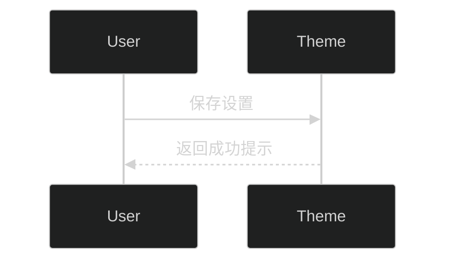

# 内容增强与多语言

higan-hz 在原主题的 Markdown 能力之上提供了大量排版增强、模式切换与多语言工具。本章节汇总常见写法及配套配置，帮助你快速创建高质量内容。

## 通用排版注意事项

- 所有 Markdown 标题、列表、表格均遵循 Halo 自带渲染。需要对样式做微调时，请优先使用主题设置中的排版开关（如标题/段落边距、引用块装饰）。
- 若文中包含大量示例，建议使用 `<details>` 折叠区，以免影响目录结构。
- 主题默认在 `article .content` 内部启用自动断词（`hyphens: auto`）。若需手动控制，可在代码块中使用 `&shy;` 插入软连字符。

## 主题扩展组件

### 引用块与拉引语

```markdown
> 这是标准引用。
>
> <footer><cite>作者名</cite></footer>
```

- `pullquote`：将引用浮动到正文旁。

```html
<blockquote class="pullquote right">
  “这是右侧的拉引用样式，正文会自动环绕。”
</blockquote>
```

可使用 `pullquote left`/`pullquote right` 指定方向。建议在引用前加上 `<div style="clear: both">` 避免布局被上一个元素影响。

### 图片说明与视频容器

```html

<div class="caption">这里是图片说明文字，可包含 <a href="#">链接</a>。</div>
```

- `video-container`：让 iframe 视频在不同屏宽下保持比例。

```html
<div class="video-container">
  <iframe src="https://player.bilibili.com/player.html?bvid=XXXX&page=1" allowfullscreen></iframe>
</div>
```

### 内容显隐（Hide / Spoiler）

```html
这段文字始终可见。<hide>鼠标悬停或选中时才会显示。</hide>

<spoiler class="blur">使用模糊效果隐藏的剧透。</spoiler>
<hide class="black">以黑块遮挡的隐藏内容。</hide>
```

- 支持 `class="blur"` 与 `class="black"` 两种视觉样式。
- `hide` 与 `spoiler` 行为相同，可根据语义选择标签。

### 明/暗模式专属内容

```html
<div class="light">
  仅在浅色模式显示的内容。
</div>

<div class="dark">
  仅在深色模式显示的内容。
</div>
```

> 若启用了“浅色/深色模式切换按钮”，上述区块会跟随用户手动切换；在自动模式下则跟随系统主题。

### 缩写与提示

```html
<abbr title="Hypertext Markup Language">HTML</abbr> 是一种标记语言。
```

- 在触屏设备或打印模式下，主题会自动将全称以括号形式补充在后。
- `abbr` 可嵌套链接，若需要去掉双下划线，可在自定义 CSS 中针对 `.content abbr a` 调整样式。

### 图标链接

```html
<a class="icon" href="javascript:void(0)">悬停时高亮的图标链接</a>
```

`class="icon"` 的链接默认不带下划线，适合包裹图标字体。

## Mermaid 与代码块

启用“全局 → Mermaid 支持”后，可使用以下两种写法：

```html
<div class="mermaid auto">
flowchart TD
  A[主题设置] --> B{多语言}
  B -->|菜单| C[导航]
  B -->|文案| D[公告栏]
</div>
```

或在 HTML 块内部嵌入原生 Markdown 代码块：

~~~html
<div class="mermaid auto">



</div>
~~~

更多配置可在“Mermaid Config 属性”中直接写入 JavaScript 对象，详见《[进阶功能](./advanced.md#mermaid)》。

### 默认编辑器写法（Hybrid Edit Block）

> 前置条件：已安装 [plugin-hybrid-edit-block](https://www.halo.run/store/apps/app-NgHnY)，并在后台启用。

1. 在默认编辑器中输入 `/html` 选择 **HTML 代码块**。
2. 粘贴以下模板，将 `[[图表正文]]` 替换为你的 Mermaid 描述即可一次生成浅/深色版本：

```html
<div class="mermaid auto">
[[图表正文]]
</div>
```

3. 如需完全控制暗/亮配色，可使用分离写法：

```html
<div class="mermaid dark">
%%{init: { "theme": "dark" }}%%
[[图表正文]]
</div>

<div class="mermaid light">
%%{init: { "theme": "light" }}%%
[[图表正文]]
</div>
```

### Vditor 编辑器写法

> 前置条件：已安装并启用 [Vditor 编辑器插件](https://www.halo.run/store/apps/app-uBcYw)。

Vditor 支持多种写法，可根据预览需求选择：

- **自动渲染（推荐）**
  ````html
  <div class="mermaid auto">

  ```mermaid
  [[图表正文]]
  ```

  </div>
  ````
  兼容实时预览，主题会在 Vditor 渲染前抢先生成图形。

- **分别维护浅/深主题**
  ````html
  <div class="light">

  ```mermaid
  %%{init: { "theme": "light" }}%%
  [[图表正文]]
  ```

  </div>

  <div class="dark">

  ```mermaid
  %%{init: { "theme": "dark" }}%%
  [[图表正文]]
  ```

  </div>
  ````

> 调试提示：若发现图表重复渲染，可清理文章缓存并重新保存；主题渲染与 Vditor 内建渲染叠加时属于正常现象。

## 多语言菜单与文案

### 菜单

1. 在主题设置启用 `全局 → 多语言菜单支持`。若需要前缀匹配，保持“多语言功能前缀匹配模式”为开启状态。
2. 前往 Halo 控制台 → `外观 → 菜单`，按照以下结构创建：
   - 顶级菜单命名为语言代码（例如 `zh_CN` 或 `en`）。
   - 在对应顶级菜单下维护该语言的导航项。
3. 与 `全局 → 默认页面语言` 相同名称的菜单会作为默认回退菜单。

> 若开启“浏览器语言自动跳转”，请确保对应语言的菜单已经存在，否则用户会看到空菜单。

### 首页公告栏与底部多语言文本

- 首页公告栏：开启 `首页样式 → 多语言个人简介/公告栏支持`，在每个条目里填写语言代码与 HTML 内容。
- 页面底部：在 `总体样式 → 多语言页面最底部内容支持` 中依语言配置 HTML 片段。

语言代码遵循 BCP 47 标准（如 `zh`, `zh-CN`, `en-US`）。若开启前缀匹配，`zh` 可同时匹配 `zh_CN` 与 `zh_TW`。

更多多语言整体流程，请参阅《[i18n 支持指南](./i18n.md)》获取完整示例。

## 语义化内容块示例

| 功能             | 推荐写法                                      | 备注                    |
| ---------------- | --------------------------------------------- | ----------------------- |
| 折叠面板         | `<details><summary>标题</summary>…</details>` | 原生 HTML，主题自动美化 |
| 图片说明         | `<div class="caption">…</div>`                | 与上一张图片绑定        |
| 自动换行的长单词 | 使用 `&shy;` 或将文本放入 `<code>`            | 代码块默认禁用自动断词  |
| 隐藏内容         | `<hide>` / `<spoiler>`                        | 支持 `blur`/`black`     |
| 明暗模式内容     | `<div class="light">` / `<div class="dark">`  | 依赖主题配色切换        |
| 拉引用           | `<blockquote class="pullquote">`              | 可配合 `left`/`right`   |
| 图标链接         | `<a class="icon">`                            | 去除下划线              |

## 仅在浅色/深色模式显示内容

有时你需要在不同配色下展示差异化内容，可组合 `div.light` 与 `div.dark`：

```html
<div class="dark">
[[深色模式内容]]
</div>

<div class="light">
[[浅色模式内容]]
</div>
```

- **默认编辑器**：同样需要借助 Hybrid Edit Block，插入 HTML 代码块后粘贴上述模板。
- **Vditor 编辑器**：可直接在 Markdown 中粘贴 HTML，无需额外插件。

> 如果开启了自动模式且处于暗色环境，`div.dark` 会生效；在浅色环境则只渲染 `div.light`。

## 与插件页面相关的内容写法

- `/links`（plugin-links）：链接描述支持 HTML，可配合 `<br>` 与 `<span>` 实现多行排版。
- `/photos`（plugin-photos）：当启用瀑布流时，请在后台上传清晰的图片，主题会自动根据配置计算列数与间距。
- `/moments`（plugin-moments）：支持 Markdown / HTML。若启用“预计阅读时间”或“字数统计”，建议同步开启 API 扩展插件以获得更准确的数据。

## 调试技巧

- 在浏览器控制台执行 `navigator.language` 可确定当前语言值，便于调试多语言菜单与公告栏。
- 使用 `document.documentElement.getAttribute('theme')` 查看当前激活的配色方案（例如 `theme-dark`）。自定义配色时可以据此验证主题切换是否生效。
- 主题中的隐藏内容在打印模式下会自动展开，如需保持隐藏，可在自定义 CSS 中追加打印限制。

---

更多针对高级配置、资源路径和安全策略的说明，请继续阅读《[进阶功能](./advanced.md)》。
