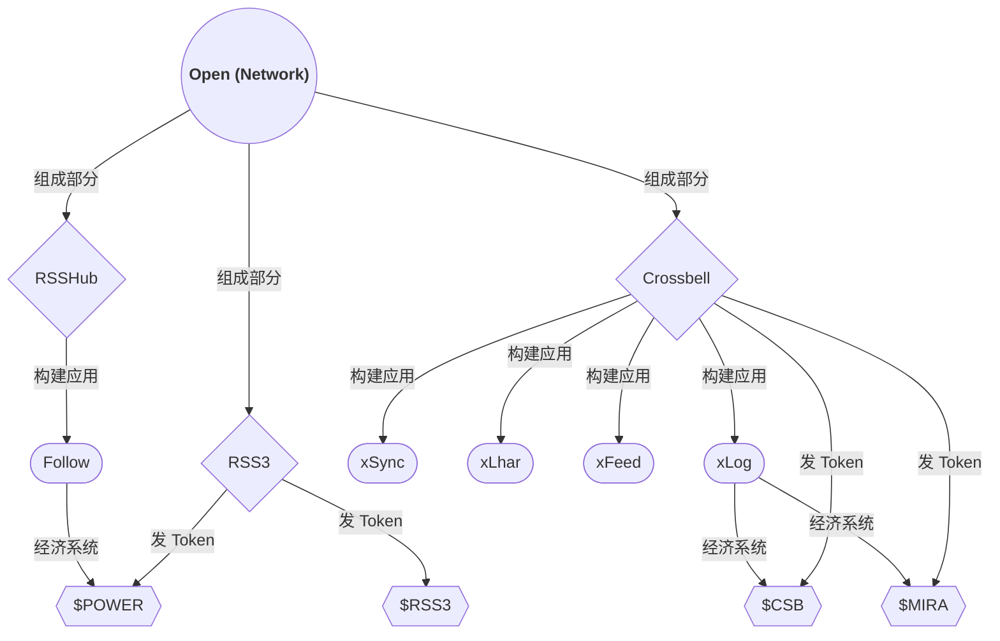
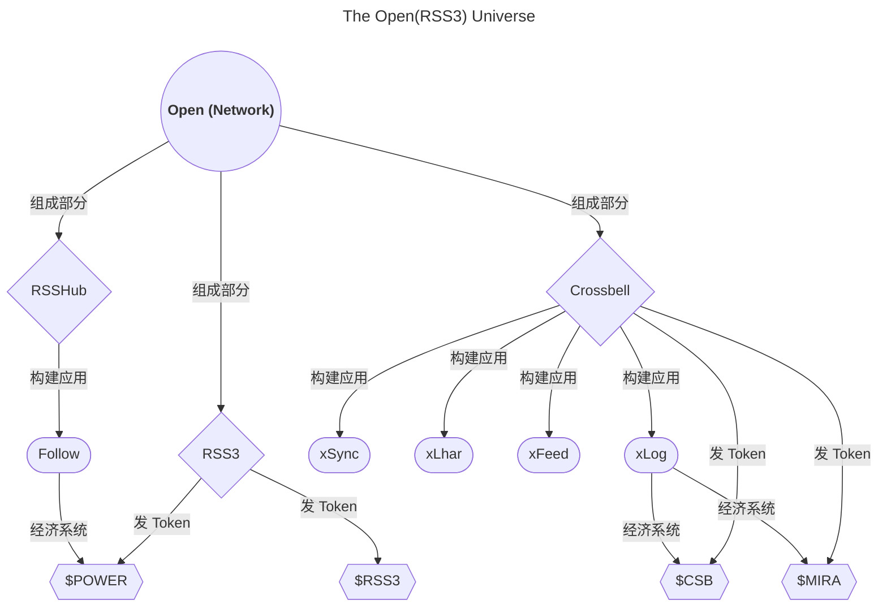
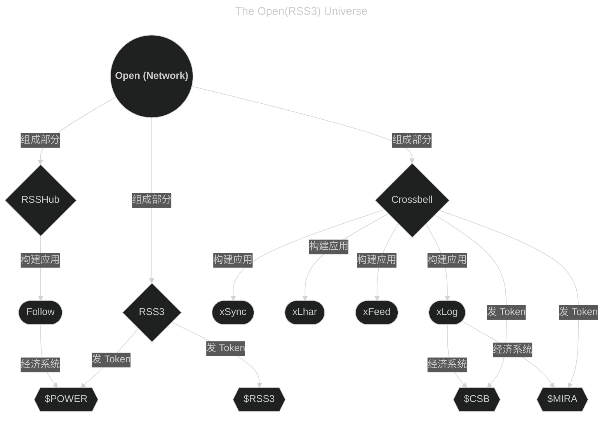

# 插件兼容性

::: danger

此页面需重写

:::

## 可选插件

- API 扩展（轻量版），需插件 [plugin-extra-api](https://github.com/HowieHz/halo-plugin-extra-api)([应用市场页面](https://www.halo.run/store/apps/app-di1jh8gd))
  - 启用插件后：
    - 单文章字数统计将自动应用插件中更准确的计算方法。
    - “总体样式 - 页面底部站点统计信息”将支持“总字数”统计显示。
- 友链页面（/links），需插件 [plugin-links](https://github.com/halo-sigs/plugin-links)([应用市场页面](https://www.halo.run/store/apps/app-hfbQg))
- <a id="plugin-photos"></a>图库页面（/photos），需插件 [plugin-photos](https://github.com/halo-sigs/plugin-photos)([应用市场页面](https://www.halo.run/store/apps/app-BmQJW))
- <a id="plugin-moments"></a>瞬间页面（/moments），需插件 [plugin-moments](https://github.com/halo-sigs/plugin-moments)([应用市场页面](https://www.halo.run/store/apps/app-SnwWD))
  - 瞬间页面可用于展示 GitHub 活动，此用法请看 [howiehz/ghu-events-moments](https://github.com/howiehz/ghu-events-moments) 或 [guqing/ghu-events-moments](https://github.com/guqing/ghu-events-moments)（兼容原主题数据类型）
- 评论功能，需插件 [plugin-comment-widget](https://github.com/halo-sigs/plugin-comment-widget/releases)([应用市场页面](https://www.halo.run/store/apps/app-YXyaD))
- 搜索功能，需插件 [plugin-search-widget](https://github.com/halo-sigs/plugin-search-widget/releases)([应用市场页面](https://www.halo.run/store/apps/app-DlacW))
- 代码渲染，需插件：[plugin-highlightjs](https://github.com/halo-sigs/plugin-highlightjs)([应用市场页面](https://www.halo.run/store/apps/app-sqpgf))
  - 暗黑模式下，代码块高亮主题推荐选择“an-old-hope.min.css”
- 图片灯箱，需插件：[plugin-lightgallery](https://github.com/halo-sigs/plugin-lightgallery)([应用市场页面](https://www.halo.run/store/apps/app-OoggD))
  - 页面匹配规则 推荐设置为

    | 路径匹配       | 匹配区域                   |
    | -------------- | -------------------------- |
    | `/archives/**` | `article .content`         |
    | `/moments`     | `article .content .medium` |
    | `/moments/**`  | `article .content .medium` |
    | `/photos`      | `article .content`         |
    | `/photos/**`   | `article .content`         |

### Mermaid 明暗切换支持

#### 使用默认编辑器

##### 适用于默认编辑器的示例

<details><summary>点我展开示例 展示使用方法</summary>

本图原始作者为 [欧雷流](https://ourai.ws/)
授权 [HowieHz](https://howiehz.top/) 重绘

> 第一种方式（以下内容作为 HTML 代码块插入默认编辑器）

<!-- prettier-ignore-start -->
<!-- autocorrect-disable -->
```html
<div class="mermaid auto">
flowchart TD
A(("`**Open (Network)**`")) -->|组成部分| RSSHub{RSSHub}
A -->|组成部分| RSS3{RSS3}
A -->|组成部分| Crossbell{Crossbell}
Crossbell -->|构建应用| xLog([xLog])
Crossbell -->|构建应用| xSync([xSync])
Crossbell -->|构建应用| xLhar([xLhar])
Crossbell -->|构建应用| xFeed([xFeed])
RSSHub -->|构建应用| Follow([Follow])
xLog -->|经济系统| $CSB
xLog -->|经济系统| $MIRA
Follow -->|经济系统| $POWER
Crossbell -->|发 Token| $CSB{{$CSB}}
Crossbell -->|发 Token| $MIRA{{$MIRA}}
RSS3 -->|发 Token| $RSS3{{$RSS3}}
RSS3 -->|发 Token| $POWER{{$POWER}}
</div>
```
<!-- autocorrect-enable -->
<!-- prettier-ignore-end -->

> 第二种方式（以下内容作为 HTML 代码块插入默认编辑器）

<!-- prettier-ignore-start -->
<!-- autocorrect-disable -->
```html
<div class="mermaid dark">
%%{init: { "theme": "dark" } }%%
flowchart TD
A(("`**Open (Network)**`")) -->|组成部分| RSSHub{RSSHub}
A -->|组成部分| RSS3{RSS3}
A -->|组成部分| Crossbell{Crossbell}
Crossbell -->|构建应用| xLog([xLog])
Crossbell -->|构建应用| xSync([xSync])
Crossbell -->|构建应用| xLhar([xLhar])
Crossbell -->|构建应用| xFeed([xFeed])
RSSHub -->|构建应用| Follow([Follow])
xLog -->|经济系统| $CSB
xLog -->|经济系统| $MIRA
Follow -->|经济系统| $POWER
Crossbell -->|发 Token| $CSB{{$CSB}}
Crossbell -->|发 Token| $MIRA{{$MIRA}}
RSS3 -->|发 Token| $RSS3{{$RSS3}}
RSS3 -->|发 Token| $POWER{{$POWER}}
</div>

<div class="mermaid light">
%%{init: { "theme": "light" } }%%
flowchart TD
A(("`**Open (Network)**`")) -->|组成部分| RSSHub{RSSHub}
A -->|组成部分| RSS3{RSS3}
A -->|组成部分| Crossbell{Crossbell}
Crossbell -->|构建应用| xLog([xLog])
Crossbell -->|构建应用| xSync([xSync])
Crossbell -->|构建应用| xLhar([xLhar])
Crossbell -->|构建应用| xFeed([xFeed])
RSSHub -->|构建应用| Follow([Follow])
xLog -->|经济系统| $CSB
xLog -->|经济系统| $MIRA
Follow -->|经济系统| $POWER
Crossbell -->|发 Token| $CSB{{$CSB}}
Crossbell -->|发 Token| $MIRA{{$MIRA}}
RSS3 -->|发 Token| $RSS3{{$RSS3}}
RSS3 -->|发 Token| $POWER{{$POWER}}
</div>
```
<!-- autocorrect-enable -->
<!-- prettier-ignore-end -->

</details>

##### 适用于默认编辑器的使用说明

1. 需插件 [plugin-hybrid-edit-block](https://github.com/halo-sigs/plugin-hybrid-edit-block)([应用市场页面](https://www.halo.run/store/apps/app-NgHnY))
2. 进入主题配置，启用 `全局-Mermaid 支持`
3. 默认编辑器中输入 `/html` 选择插入 HTML 代码块

输入以下内容，将 `[[图表标题]]` 和 `[[图表正文]]` 换成你自己的内容，  
即可适配明暗切换

> 第一种方式：只写一遍，自动生成浅色/深色模式下两种图表

<!-- prettier-ignore-start -->
```html
<div class="mermaid auto">
[[图表正文]]
</div>
```
<!-- prettier-ignore-end -->

> 第二种方式：手动管理浅色/深色模式下的图表

<!-- prettier-ignore-start -->
```html
<div class="mermaid dark">
%%{init: { "theme": "dark" } }%%
[[图表正文]]
</div>

<div class="mermaid light">
%%{init: { "theme": "light" } }%%
[[图表正文]]
</div>
```
<!-- prettier-ignore-end -->

#### 使用 Vditor 编辑器

需启用 [Vditor 编辑器插件](https://github.com/justice2001/halo-plugin-vditor)([应用市场页面](https://www.halo.run/store/apps/app-uBcYw))，并进入文章编辑页，将文章编辑器设置为 Vditor 编辑器。

##### 适用于 Vditor 编辑器的示例

<details><summary>点我展开示例 展示使用方法</summary>

````markdown
本图原始作者为 [欧雷流](https://ourai.ws/)
授权 [HowieHz](https://howiehz.top/) 重绘

## 第一种方式

<div class="mermaid auto">
flowchart TD
A(("`**Open (Network)**`")) -->|组成部分| RSSHub{RSSHub}
A -->|组成部分| RSS3{RSS3}
A -->|组成部分| Crossbell{Crossbell}
Crossbell -->|构建应用| xLog([xLog])
Crossbell -->|构建应用| xSync([xSync])
Crossbell -->|构建应用| xLhar([xLhar])
Crossbell -->|构建应用| xFeed([xFeed])
RSSHub -->|构建应用| Follow([Follow])
xLog -->|经济系统| $CSB
xLog -->|经济系统| $MIRA
Follow -->|经济系统| $POWER
Crossbell -->|发 Token| $CSB{{$CSB}}
Crossbell -->|发 Token| $MIRA{{$MIRA}}
RSS3 -->|发 Token| $RSS3{{$RSS3}}
RSS3 -->|发 Token| $POWER{{$POWER}}
</div>

## 第二种方式

<div class="mermaid auto">



</div>

## 第三种方式

<div class="light">



</div>

<div class="dark">



</div>
````

</details>

##### 适用于 Vditor 编辑器的使用说明

输入以下内容，将 `[[图表标题]]` 和 `[[图表正文]]` 换成你自己的内容，  
即可适配明暗切换。  
注意：下列模板中出现的空行不可省略，没出现空行的也不能多添加空行。建议使用分屏预览模式编辑。

> 第一种方式：只写一遍，自动生成浅色/深色模式下两种图表  
> 此方式需要进入主题配置，启用 `全局-Mermaid 支持`  
> 缺点：不兼容 Vditor 编辑器的实时预览

<!-- prettier-ignore-start -->
```html
<div class="mermaid auto">
[[图表正文]]
</div>
```
<!-- prettier-ignore-end -->

> 第二种方式：只写一遍，自动生成浅色/深色模式下两种图表  
> 此方式需要进入主题配置，启用 `全局-Mermaid 支持`  
> 此方式原理：由于主题的 Mermaid 初始化先加载，可在 Vditor 自带的 Mermaid 渲染前抢先渲染生成  
> 缺点：一张图会多被渲染一遍（被 Vditor 自带的 Mermaid 多渲染一遍）  
> 优点：兼容 Vditor 编辑器的实时预览

<!-- prettier-ignore-start -->
````html
<div class="mermaid auto">

```mermaid
[[图表正文]]
```

</div>
````
<!-- prettier-ignore-end -->

> 第三种方式：手动管理浅色/深色模式下的图表  
> 缺点：同样内容要复制粘贴一遍。由于是完全使用 Vditor 自带的渲染，所以主题设置中有关 Mermaid 的设置会失效。会继承上游的 bug，如 [mermaid-js/mermaid@5741](https://github.com/mermaid-js/mermaid/issues/5741)。  
> 优点：兼容 Vditor 编辑器的实时预览，兼容性最好。完全使用 Vditor 自带的渲染，和预览表现一致。

<!-- prettier-ignore-start -->
````html
<div class="light">

```mermaid
---
title: [[图表标题]]
---
%%{init: { "theme": "light" } }%%
[[图表正文]]
```

</div>

<div class="dark">

```mermaid
---
title: [[图表标题]]
---
%%{init: { "theme": "dark" } }%%
[[图表正文]]
```

</div>
````
<!-- prettier-ignore-end -->
